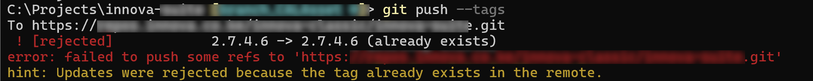
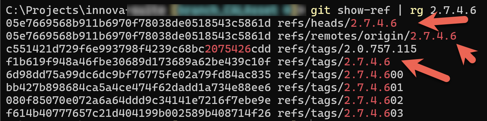
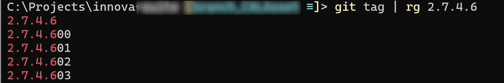
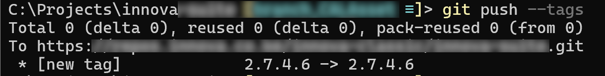

Recently, I was doing some maintenance and, upon conclusion, ran the [git](https://git-scm.com/) command to push my local [tags](http://www.w3schools.com/GIT/git_tagging.asp?remote=github) to the remote.

```bash
git push --tags
```

I got the following error:



Fair enough. The tag seemingly **already exists**. And since I am sure the **local one** is the one that I want to **keep**, I can **delete the remote one**.

```bash
 git push --delete origin  2.7.4.6
```

This, to my surprise, also complained.


How is it possible that this tag exists **multiple times** in the remote?

Git has a command, [show-ref](https://git-scm.com/docs/git-show-ref), that is **useful** for this type of problem.

I could run that command and then **pipe** the results to [grep](https://en.wikipedia.org/wiki/Grep).

```bash
git show-ref | rg 2.7.4.6
```

Here I am using [ripgrep](https://github.com/burntsushi/ripgrep), but whichever you use should still work

I got the following results:



My tag appears `3` times.

The problem here seems to be that there is a **tag** and a **branch**, **both** named `2.7.4.6`

I can restrict the search to **tags**:

```bash
git tag | rg 2.7.4.6
```

Which returns what I expect.



I can then try the **branches**:

```bash
 git branch --all | rg 2.7.4.6
```


And there is our culprit.

There is a **branch** with the **same name**, which is almost certainly a **mistyped command**, since we use a specific naming convention for **branches** and **tags**.

Cleanup is simple enough.

First, **delete the local branch**.

```bash
git branch -d 2.7.4.6
```

Then, **delete the remote branch**:

```bash
git push origin :refs/heads/2.7.4.6
```

Then, **delete the local tag**:

```bash
git tag -d 2.7.4.6
```

And finally, **delete the remote tag**.

```bash
 git push --delete origin  2.7.4.6
```

The delete should now **succeed**.


And now, we should be able to push our tags.



**WARNING: Be certain that you know what you want to keep - the local or the remote!**

Happy hacking!
