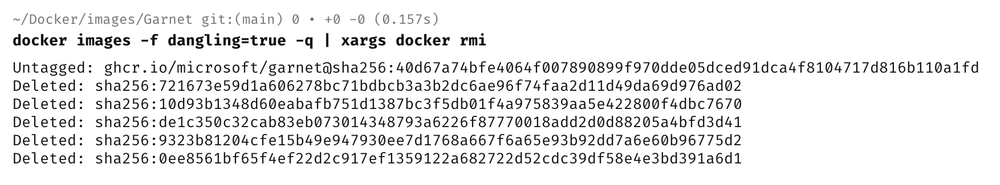

In a previous post, "[How To Remove Multiple Docker Images]()", we looked at how to remove multiple [Docker](https://www.docker.com/) images using the command line.

There we would **remove multiple docker images** like this:

```bash
docker rm 24fab8b8f344 2ce96c2e6070 4ff3513d4576
```

Or, more efficiently, like this:

```bash
docker rmi 24 2c 4f
```

The problem with this approach is that you need to know the [image IDs](https://windsock.io/explaining-docker-image-ids/) **in advance**.

There is a **simpler** way to do this using some command line kung fu.

Run the following command:

```bash
docker images -f dangling=true -q | xargs docker rmi -f | xargs docker rmi -f
```

 A bunch of things is happening here:

```bash
docker images -f dangling=true -q
```

This **lists all the dangling images**. and the `-q` flag outputs **only** the `IDs`.

```bash
|
```

This **pipes each of the results** of the first command into the second command.

```bash
xargs
```

This takes the input from the pipe and converts it into command line arguments for a subsequent command.

```bash
docker rmi -f
```

This removes the actual image specified by the received `ID`.



## TLDR

You can remove dangling docker images with a single command.

Happy hacking!
