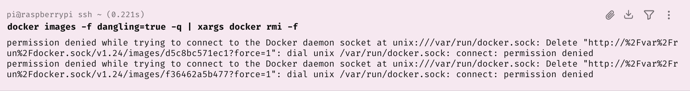
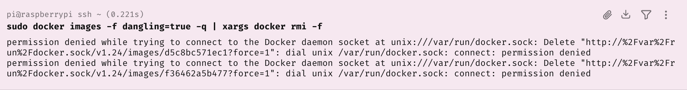
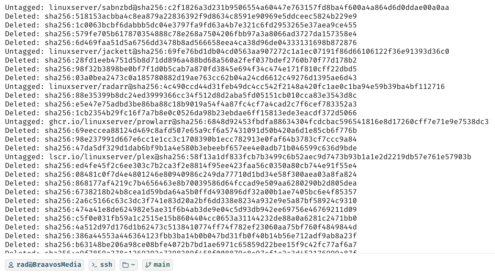

In yesterday's post, "[Removing Multiple Docker Images (Improved)]()", we looked at how to remove multiple Docker images in a single command.

The command is as follows:

```bash
docker images -f dangling=true -q | xargs docker rmi -f
```

In this post, we will look at how to tackle the following error:



I got this error on a **Linux** box, which was strange because the same command works perfectly on **macOS**.

The difference is that on [macOS](https://en.wikipedia.org/wiki/MacOS), my [Orbstack](https://orbstack.dev/) setup does not require [root access](https://www.huntress.com/cybersecurity-101/topic/root-access), whereas on [Linux](https://en.wikipedia.org/wiki/Linux), it typically does.

The fix sounds simple. Slap a [sudo](https://en.wikipedia.org/wiki/Sudo) in front of it.

```bash
sudo docker images -f dangling=true -q | xargs docker rmi -f
```

This returns the **same error**!



The problem here is that there are actually **two** commands that you are executing:

1. `docker images`
2. `docker rmi`

**BOTH** of them require `sudo`.

So the command is actually as follows:

```bash
sudo docker images -f "dangling=true" -q | xargs -r sudo docker rmi -f
```

You should see something like this (assuming you **have** danging images):



### TLDR

**When running Docker with root access, removing multiple images requires additional effort.**

Happy hacking!
