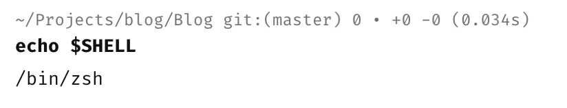
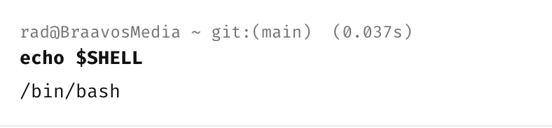

If you are on [Linux](https://en.wikipedia.org/wiki/Linux) or [macOS](https://en.wikipedia.org/wiki/MacOS), chances are you already know your [shell](https://en.wikipedia.org/wiki/Unix_shell). This is even more so if you have made any customizations to your command-line experience.

However, how would you **check**?

You echo the `$SHELL` variable.

```bash
echo $SHELL
```

On **macOS**, it returns thus:



On **Linux**, it returns thus:



Of course you could have changed your shell to **something else**, in which case whatever you changed to will be returned.

Happy hacking!
