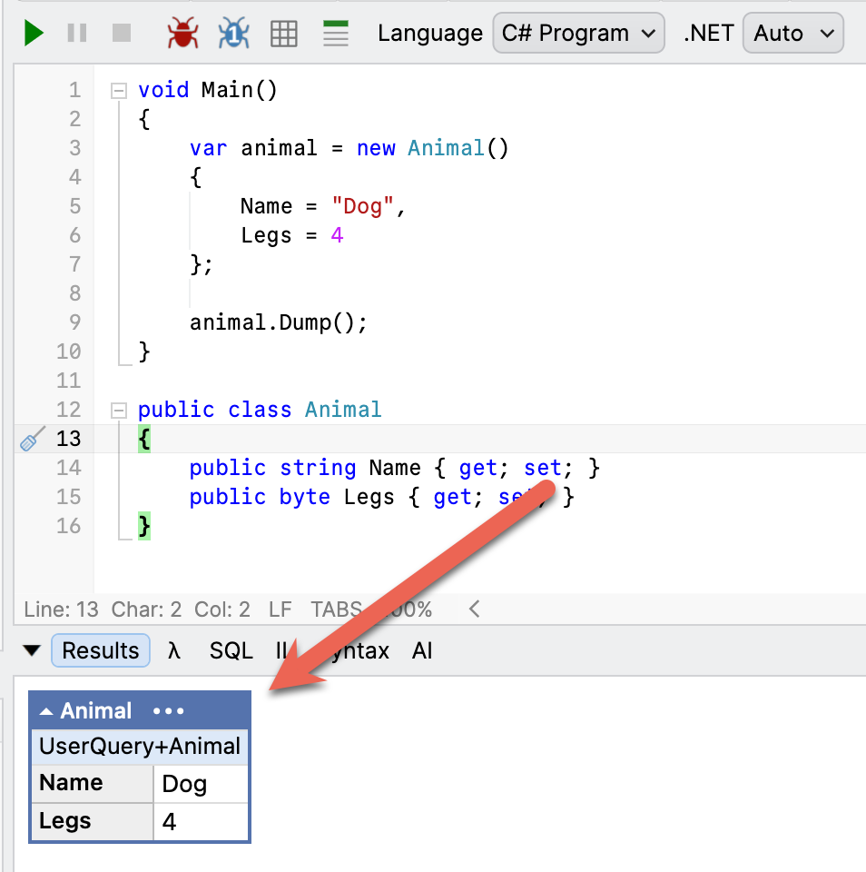
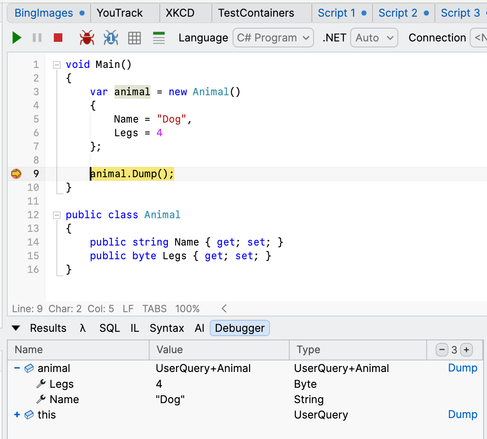
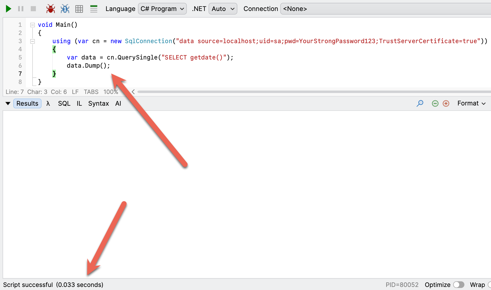
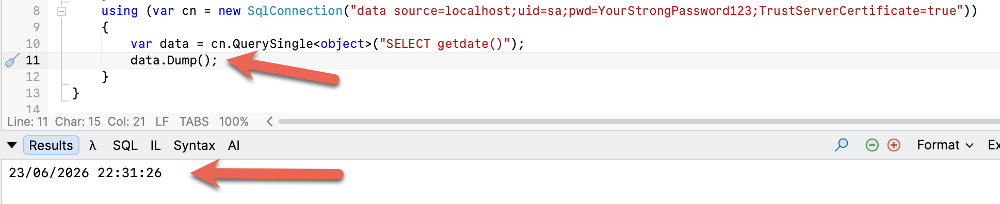

If you are a [.NET developer](https://dotnet.microsoft.com/), you must have come across and used [Joe Albahari'](https://www.albahari.com/)s [LinqPad](https://www.linqpad.net/).

This is a **brilliant** tool for quick **prototyping** and **experimentation**.

It is [basically free, but for a small fee](https://www.linqpad.net/Purchase.aspx), you get autocompletion, refactoring, [Nuget](https://nuget.org/) package management, and a bunch of other useful aids.

One of its most powerful features is its ability to **render an object to its console** using the `Dump` [extension method](https://learn.microsoft.com/en-us/dotnet/csharp/programming-guide/classes-and-structs/extension-methods).

Take this `type`:

```c#
public class Animal
{
	public string Name { get; set; }
	public byte Legs { get; set; }
}
```

We use it like this:

```c#
var animal = new Animal()
{
  Name = "Dog",
  Legs = 4
};
```

Normally, if you want to visualize your `Animal`, you either use your favourite debugger (which **LinqPad** also has) or [override](https://learn.microsoft.com/en-us/dotnet/csharp/language-reference/keywords/override) [ToString](https://learn.microsoft.com/en-us/dotnet/api/system.object.tostring?view=net-10.0).

In **LinqPad**, you simply call the `Dump` method.

```c#
animal.Dump();
```

This will do the following:



This can **save a lot of time**.

You can also set [breakpoints](https://en.wikipedia.org/wiki/Breakpoint) and examine your objects the usual way:



An interesting thing happens when your type is [dynamic](https://learn.microsoft.com/en-us/dotnet/csharp/advanced-topics/interop/using-type-dynamic).

As it the case here:

```c#
using (var cn = new SqlConnection("data source=localhost;uid=sa;pwd=YourStrongPassword123;TrustServerCertificate=true"))
{
  var data = cn.QuerySingle("SELECT getdate()");
  data.Dump();
}
```

This should **print** the **date** to the console.

However, it does **nothing**!



The solution to this is to make your `dynamic` type an [object](https://learn.microsoft.com/en-us/dotnet/api/system.object?view=net-10.0).

```c#
using (var cn = new SqlConnection("data source=localhost;uid=sa;pwd=YourStrongPassword123;TrustServerCertificate=true"))
{
  var data = cn.QuerySingle<object>("SELECT getdate()");
  data.Dump();
}
```

This now **behaves**.



### TLDR

**If you want to display a `dynamic`, cast it to an `object`.**

Happy hacking!
