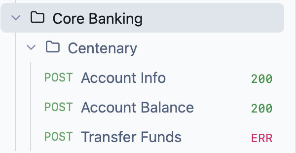
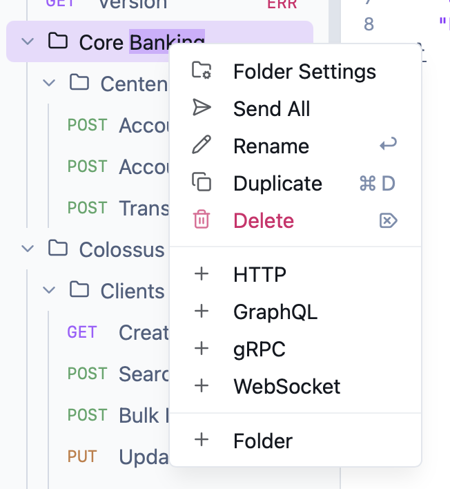
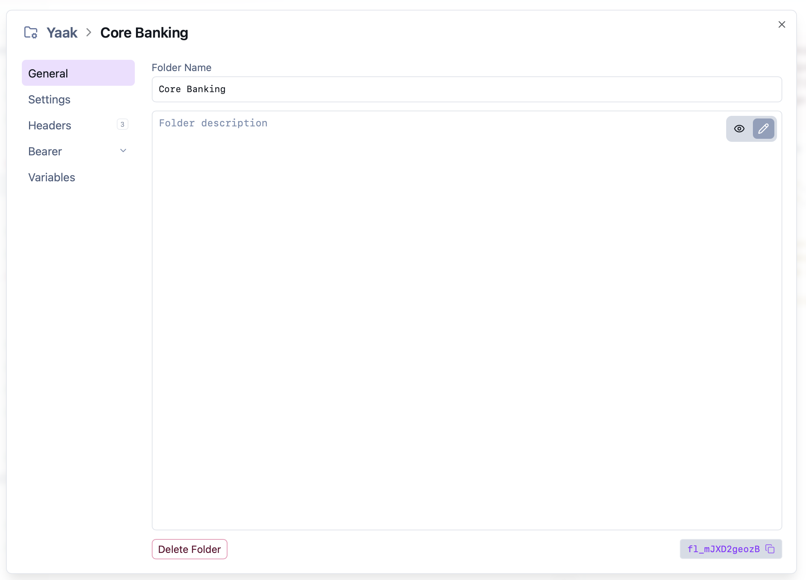
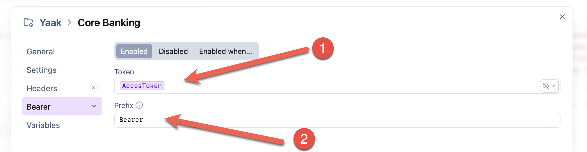
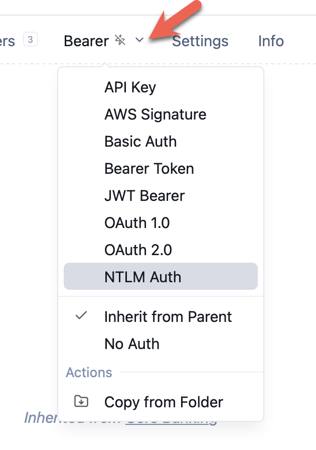

I am a recent and happy convert to the API & endpoint testing tool [Yaak,](https://yaak.app/) which has now **replaced** my previous go-to, [Insomnia](https://insomnia.rest/).

As I've mentioned before, both tools were written by the same gentleman, **Greg**. You can read the story [here](https://yaak.app/blog/yet-another-api-client).

In a previous post, "[Automatically Fetching an Identity Server Token with Yaak]()", we looked at how to set up **Yaak** to **automatically fetch** identity server [tokens](https://oauth.net/2/access-tokens/).

However, in that post, we set it up at the **endpoint level**, and it can be very **repetitive**, not to mention **inflexible**, to set that up **repeatedly per endpoint.**

A better approach is to set it up at the **folder** level.

First, create a **folder** that will host your endpoints.

Next, right-click the folder to get the context menu.

Next, click **Settings**:

Navigate to the **Bearer** menu:

Here we provide two things:

1. The **token name** you set up, as [outlined in this post]().
2. The [prefix](https://medium.com/@kapilkokcha.k/why-do-we-use-bearer-in-api-authentication-9a80db016dbe) `Bearer`

And we're done.

By default, new endpoints will **automatically inherit** this, as indicated by the icon and **explicit message**.

However, if you want to, you can **override** this by clicking on the heading.

### TLDR

**You can set identity server authentication and authorization at the folder level, and all endpoints in that folder will inherit this.**

Happy hacking!
