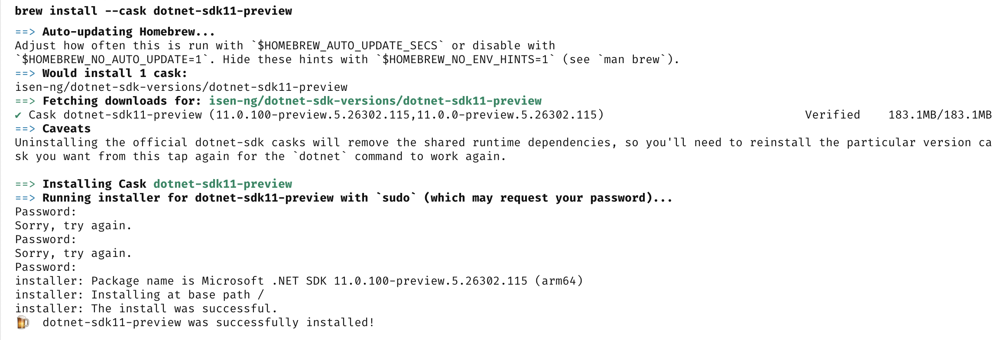
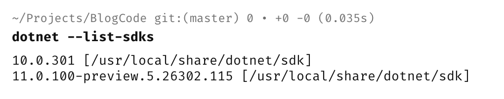
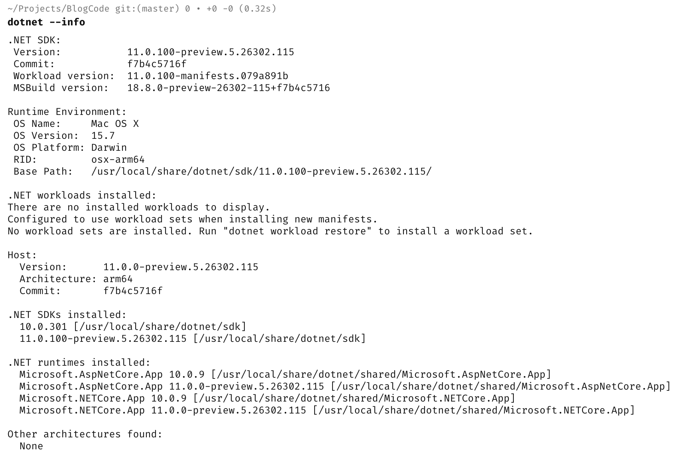

[.NET 10](https://learn.microsoft.com/en-us/dotnet/core/whats-new/dotnet-10/overview) was released last year and work is in progress on **.NET 11**, due for release this year. As a reminder, there is an [annual release cycle](https://dotnet.microsoft.com/en-us/platform/support/policy) for .NET (a [topic](https://www.c-sharpcorner.com/blogs/understanding-lts-vs-sts-in-net-choosing-the-right-support-model-for-your-project) of [hot](https://dev.to/ismcagdas/what-net-10-lts-means-for-enterprise-applications-2cdh) [debate](https://www.evincia.co/dotnet-release-cycle.html)).

Time has come to see what's coming, so I wanted to install the latest version of the SDK.

I am using the work of [isen-ng](https://github.com/isen-ng/homebrew-dotnet-sdk-versions) to support having multiple versions of the SDK on my primary machine running in [macOS](https://en.wikipedia.org/wiki/MacOS) 15.

**.NET 11** is available in **preview**.

You install it as follows, using [Homebrew](https://brew.sh/).

```bash
brew install --cask dotnet-sdk11-preview
```

You should see something like this:



We can then **verify** it installed as follows:

```bash
dotnet --list-sdks
```

Which should show something like this:



Finally we can check that it runs. 

```bash
dotnet --info
```

Which will print something like this:



And it seems we're **good to go**.

### TLDR

**.NET 11 betas are available.**

Happy hacking!
