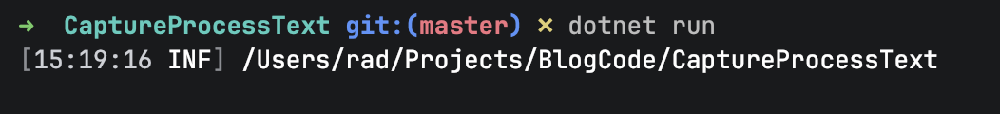
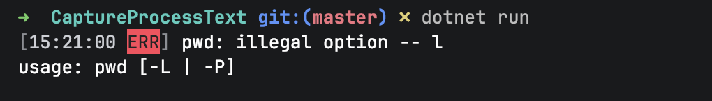

Occasionally it is necessary to run a program, typically a **terminal** program, and **capture its output**.

This is possible in .NET using the [Process](https://learn.microsoft.com/en-us/dotnet/api/system.diagnostics.process?view=net-10.0) and [ProcessStartInfo](https://learn.microsoft.com/en-us/dotnet/api/system.diagnostics.processstartinfo?view=net-10.0) classes.

Typically you would do it like this:

```c#
Log.Logger = new LoggerConfiguration()
  .WriteTo.Console()
  .CreateLogger();

var startInfo = new ProcessStartInfo
{
  FileName = "pwd",
  RedirectStandardOutput = true,
  RedirectStandardError = true,
  UseShellExecute = false,
  CreateNoWindow = true
};

using (var process = Process.Start(startInfo))
{
  var output = await process.StandardOutput.ReadToEndAsync();
  var error = await process.StandardError.ReadToEndAsync();

  await process.WaitForExitAsync();

  if (process.ExitCode == 0)
  	Log.Information(output);
  else
    Log.Error(error);
}
```

As you can see, this requires quite a bit of **orchestration**.

In .NET 11, this has been simplified using new methods - [RunAndCaptureText](https://learn.microsoft.com/en-us/dotnet/api/system.diagnostics.process.runandcapturetext?view=net-11.0) and its [async](https://learn.microsoft.com/en-us/dotnet/csharp/asynchronous-programming/) counterpart, [RunAndCaptureTextAsync](https://learn.microsoft.com/en-us/dotnet/api/system.diagnostics.process.runandcapturetextasync?view=net-11.0), that have been added to the `Process` class.

The code is as follows:

```c#
Log.Logger = new LoggerConfiguration()
  .WriteTo.Console()
  .CreateLogger();

var result = await Process.RunAndCaptureTextAsync("pwd");
if (result.ExitStatus.ExitCode == 0)
  Log.Information(result.StandardOutput);
else
  Log.Error(result.StandardError);
```

You can see here that the code is **much less**.

This should return something like this:



If you wanted to pass **arguments** to your command, you would do it like this, using the overload that takes **arguments**:

```c#
Log.Logger = new LoggerConfiguration()
  .WriteTo.Console()
  .CreateLogger();

var result = await Process.RunAndCaptureTextAsync("pwd", ["-l"]);
if (result.ExitStatus.ExitCode == 0)
  Log.Information(result.StandardOutput);
else
	Log.Error(result.StandardError);
```

This will return the following:



### TLDR

**The Process class now has new methods, `RunAndCaptureText` and `RunAndCaptureTextAsync,` for capturing output and errors from command-line/terminal applications.**

The code is in my [GitHub](https://github.com/conradakunga/BlogCode/tree/master/2026-07-04%20-%20CaptureProcessText).

Happy hacking!
