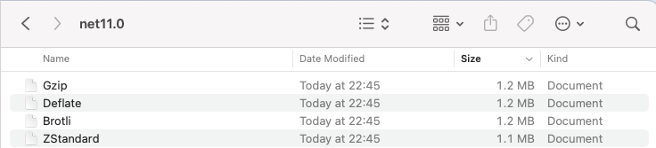
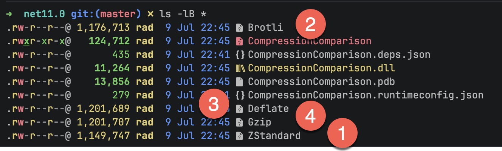

When it comes to **compression** of data, there are a number of options natively available on .NET

- [Brotli](https://learn.microsoft.com/en-us/dotnet/api/system.io.compression.brotlistream?view=net-10.0)
- [Gzip](https://learn.microsoft.com/en-us/dotnet/api/system.io.compression.gzipstream?view=net-10.0)
- [Deflate](https://learn.microsoft.com/en-us/dotnet/api/system.io.compression.deflatestream?view=net-10.0)

These are especially useful in scenarios where you are operating with [streams](https://learn.microsoft.com/en-us/dotnet/api/system.io.stream?view=net-10.0), such as when serving **files** on a **web server**.

When it comes to **compression**, there are usually tradeoffs that you have to make between:

- File **size**
- Compression **time**
- **Processor** usage

In .NET 11, a new algorithm has been introduced - [Zstandard](https://en.wikipedia.org/wiki/Zstd), also known as [zstd](https://github.com/facebook/zstd).

This, like the others, is in the [System.IO.Compression](https://learn.microsoft.com/en-us/dotnet/api/system.io.compression?view=net-10.0) namespace.

For this demonstration, we will use a copy of our old friend, [Leo Tolstoy](https://en.wikipedia.org/wiki/Leo_Tolstoy)'s tome, [War and Peace](https://en.wikipedia.org/wiki/War_and_Peace).

We start by updating our `.csproj` to **reference** our file at the **root** of the project.

```xml
<ItemGroup>
  <None Include="war-and-peace.txt">
  	<CopyToOutputDirectory>PreserveNewest</CopyToOutputDirectory>
  </None>
</ItemGroup>
```

Next, we write code to compress the file using the 3 algorithms and the new `zstd`.

```c#
using System.IO.Compression;
using System.Reflection;

const string fileName = "war-and-peace.txt";
// Build path to store the files
var targetPath = new FileInfo(Assembly.GetExecutingAssembly().Location).Directory!.FullName;

// ZStandard
await using (var inputStream = File.OpenRead(fileName))
{
    await using (var outputStream = File.Create(Path.Combine(targetPath, "ZStandard")))
    {
        await using (var compressStream = new ZstandardStream(outputStream, CompressionMode.Compress))
        {
            await inputStream.CopyToAsync(compressStream);
        }
    }
}

// Brotli
await using (var inputStream = File.OpenRead(fileName))
{
    await using (var outputStream = File.Create(Path.Combine(targetPath, "Brotli")))
    {
        await using (var compressStream = new BrotliStream(outputStream, CompressionMode.Compress))
        {
            await inputStream.CopyToAsync(compressStream);
        }
    }
}

// Gzip
await using (var inputStream = File.OpenRead(fileName))
{
    await using (var outputStream = File.Create(Path.Combine(targetPath, "Gzip")))
    {
        await using (var compressStream = new GZipStream(outputStream, CompressionMode.Compress))
        {
            await inputStream.CopyToAsync(compressStream);
        }
    }
}

// Deflate
await using (var inputStream = File.OpenRead(fileName))
{
    await using (var outputStream = File.Create(Path.Combine(targetPath, "Deflate")))
    {
        await using (var compressStream = new DeflateStream(outputStream, CompressionMode.Compress))
        {
            await inputStream.CopyToAsync(compressStream);
        }
    }
}
```

If we navigate to the output folder, we will see our files:



We can view the sizes in detail in the **console**:



We can see here that in **decreasing** size:

1. ZStandard
2. Brotli
3. Deflate
4. GZip

### TLDR

**.NET 11 has introduced the *ZStandard* compression algorithm in the `System.IO.Compression` namespace.**

The code is in my [GitHub](https://github.com/conradakunga/BlogCode/tree/master/2026-07-08%20-%20CompressionComparison).

Happy hacking!
