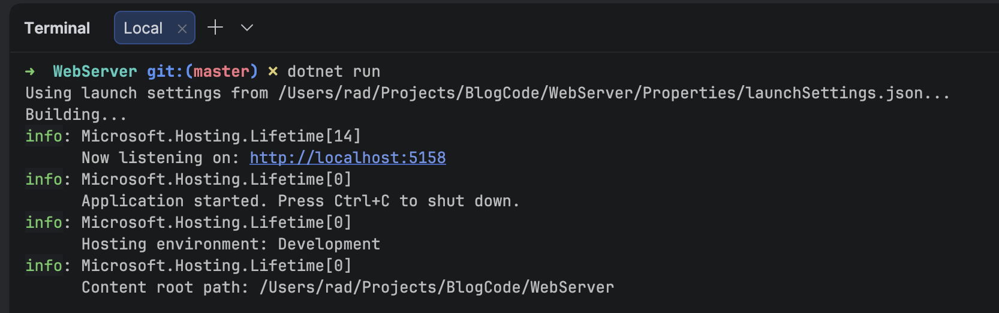
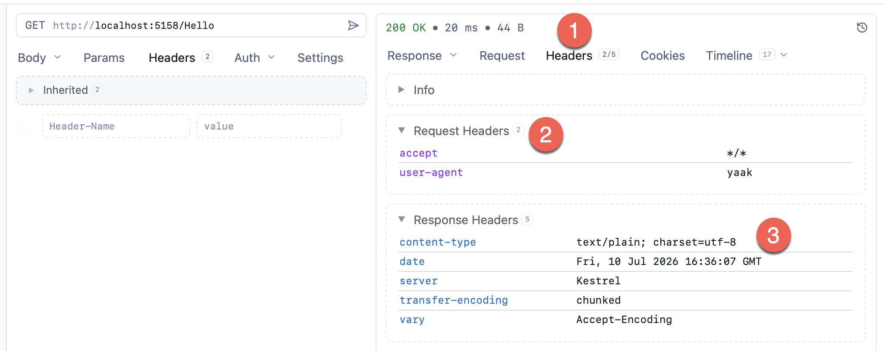
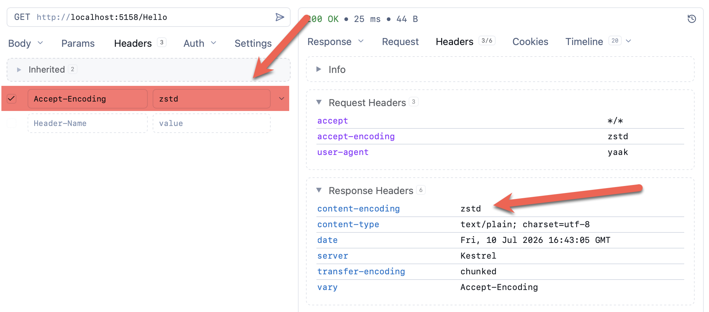
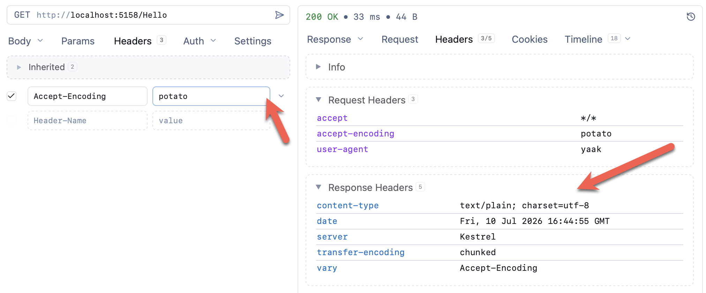

In a previous post, "[.NET 11 Preview - Zstandard Compression]()", we looked at the introduction of [Zstandard](https://en.wikipedia.org/wiki/Zstd) **compression algorithm** in .NET 11.

In this post we will look at how to enable `Zstandard` **HTTP compression** in [ASP.NET](https://dotnet.microsoft.com/en-us/apps/aspnet) **web applications** and **API project**s.

The good news is that you don't have to do much - simply **turn it on** as follows:

```c#
var builder = WebApplication.CreateBuilder(args);
// Register the response compression services
builder.Services.AddResponseCompression();
var app = builder.Build();
// Turn on the middleware
app.UseResponseCompression();
// Register a route
app.MapGet("/Hello", () => "The quick brown fox jumped over the lazy dog");
// Start the application
app.Run();
```

The magic is in these lines:

```c#
builder.Services.AddResponseCompression();
```

Here we are configuring our services to **inject** compression services.

```c#
app.UseResponseCompression();
```

Here we are instructing our web application to use the compression [middleware](https://learn.microsoft.com/en-us/aspnet/core/fundamentals/middleware/?view=aspnetcore-10.0).

We then **start** our application:



Then using your favourite tool, make a request.

My tool of choice is [Yaak](https://yaak.app/).



Couple of things to note here from Yaak

1. The **Headers** section allows you to view your headers (request and response)
2. These are the [request headers](https://developer.mozilla.org/en-US/docs/Glossary/Request_header)
3. These are the [response header](https://developer.mozilla.org/en-US/docs/Glossary/Response_header)

Note here that the content-type is  `text/plain; charset=utf-8`, indicating that **no compression** has been used at all.

The client needs to **request** this.

This is done via the [accept-encoding](https://developer.mozilla.org/en-US/docs/Web/HTTP/Reference/Headers/Accept-Encoding) header, specifying **at least one** compression type.

To request `Zstandard` compression, specify `zstd` in the header.



Here you can see the server responded with a [content-encoding](https://developer.mozilla.org/en-US/docs/Web/HTTP/Reference/Headers/Content-Encoding) header, indicating the compression it used.

If you specify something that it does not understand, this header will not be returned at all and your content will be returned **uncompressed**.



The allowed values (at least for [Kestrel](https://learn.microsoft.com/en-us/aspnet/core/fundamentals/servers/kestrel?view=aspnetcore-10.0)) are as follows:

- `br`, for [Brotli](https://en.wikipedia.org/wiki/Brotli) compression
- `gzip`, for [GZip](https://en.wikipedia.org/wiki/Gzip) compression

### TLDR

**.NET 11 supports `Zstandard` HTTP compression out of the box. You just need to turn it on.**

The code is in my GitHub.

Happy hacking!
