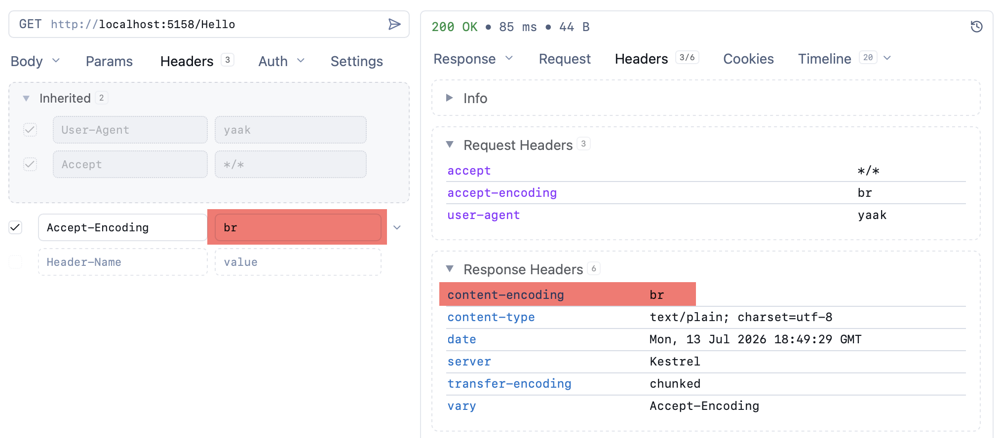
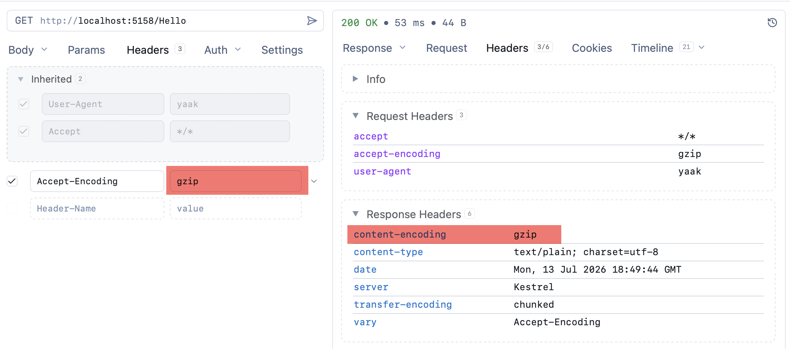
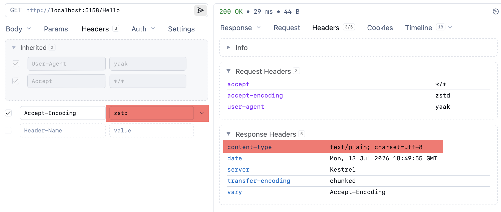

In yesterday's post, "[.NET 11 Preview - Enabling Zstandard Compression in Kestrel]()", we looked at how to enable [Zstandard](https://en.wikipedia.org/wiki/Zstd) **content compression** in [Kestrel](https://learn.microsoft.com/en-us/aspnet/core/fundamentals/servers/kestrel?view=aspnetcore-10.0).

In this post, we will look at how to turn it **off**.

The simplest way is to **not configure this feature** in the middleware.

In other words, instead of this:

```c#
var builder = WebApplication.CreateBuilder(args);
// Register the response compression services
builder.Services.AddResponseCompression();
var app = builder.Build();
// Turn on the middleware
app.UseResponseCompression();
// Register a route
app.MapGet("/Hello", () => "The quick brown fox jumped over the lazy dog");
// Start the application
app.Run();
```

Your setup should look like this:

```c#
var builder = WebApplication.CreateBuilder(args);
var app = builder.Build();
// Register a route
app.MapGet("/Hello", () => "The quick brown fox jumped over the lazy dog");
// Start the application
app.Run();
```

This is the simplest option, and here you will get **no content compression at all**.

The more sophisticated way is to **selectively enable the compression algorithms** that you want.

The code will look like this:

```c#
using Microsoft.AspNetCore.ResponseCompression;

var builder = WebApplication.CreateBuilder(args);
// Register the response compression services
builder.Services.AddResponseCompression(options =>
{
    //
    // Remove all the providers
    //
    options.Providers.Clear();

    //
    // Add back the ones we want
    //

    // First, brotli
    options.Providers.Add<BrotliCompressionProvider>();
    // Next, gzip
    options.Providers.Add<GzipCompressionProvider>();
});
var app = builder.Build();
// Turn on the middleware
app.UseResponseCompression();
// Register a route
app.MapGet("/Hello", () => "The quick brown fox jumped over the lazy dog");
// Start the application
app.Run();
```

Here we are doing the following:

1. **Removing all**  compression providers
2. **Re-registering** the ones we want to use

We can **verify** that the compression works.

`Brotli`:



`Gzip`



`Zstandard` is **not compressed**:



### TLDR

**You can control whether or not to use `Zstandard` compression in `Kestrel`.**

The code is in my GitHub.

Happy hacking!
