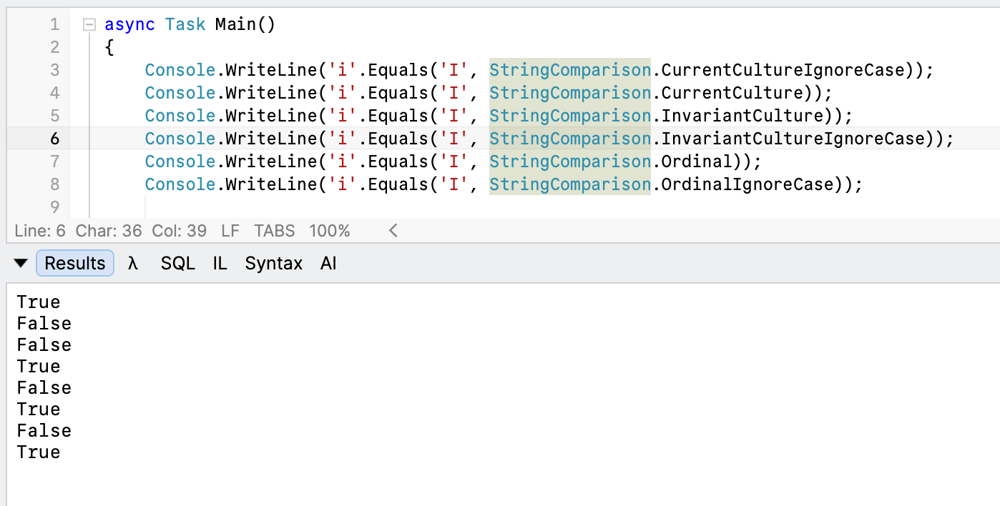

One of the problems you will invariably run into is correctly comparing [characters](https://learn.microsoft.com/en-us/dotnet/csharp/language-reference/builtin-types/char).

Quick, are these equivalent?

`I` and `i`

As with all things, the answer is "**it depends**"!

However, in .NET 10 and earlier, you don't have much choice when you use the [Equals](https://learn.microsoft.com/en-us/dotnet/api/system.char.equals?view=net-10.0) method to compare.

```c#
Console.WriteLine('i'.Equals('I'));
```

This takes only one parameter: the `char` to compare to`.` And therefore our example here will **always** return `false`.

Luckily, there are ways to perform this comparison and still tell your code how to compare, but you have to convert the `char` to a [string](https://learn.microsoft.com/en-us/dotnet/api/system.string?view=net-10.0) first, then specify **how** to compare.

```c#
Console.WriteLine(string.Equals('i'.ToString(), 'I'.ToString(), StringComparison.CurrentCultureIgnoreCase));
```

In .NET 11, this **extra step has been removed**, and the `char` Equals method now has an [overload](https://learn.microsoft.com/en-us/dotnet/api/system.char.equals?view=net-11.0#system-char-equals(system-char-system-stringcomparison)) that allows you to specify the comparison.

```c#
Console.WriteLine('i'.Equals('I', StringComparison.CurrentCultureIgnoreCase));
Console.WriteLine('i'.Equals('I', StringComparison.CurrentCulture));
Console.WriteLine('i'.Equals('I', StringComparison.InvariantCulture));
Console.WriteLine('i'.Equals('I', StringComparison.InvariantCultureIgnoreCase));
Console.WriteLine('i'.Equals('I', StringComparison.Ordinal));
Console.WriteLine('i'.Equals('I', StringComparison.OrdinalIgnoreCase));
```

This will print the following:



### TLDR

**`Char.Equals` now has an *overload* that allows you to specify how to compare.**

Happy hacking!
