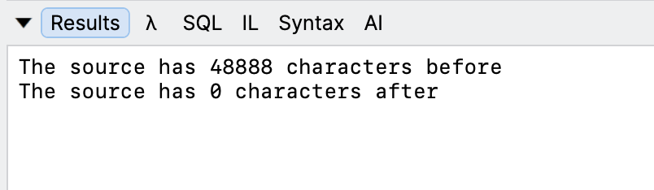

One of the data structures that a developer will quickly add to their tool-belt is the [StringBuilder](https://learn.microsoft.com/en-us/dotnet/api/system.text.stringbuilder?view=net-10.0).

Creating  and allocating a [string](https://learn.microsoft.com/en-us/dotnet/csharp/programming-guide/strings/) is an **expensive** process, especially if done **repeatedly**.

Code such as this is **problematic**:

```c#
var str = "";
for (var i = 1; i < 10_000; i++)
{
	str += $"{i} ";
}
Console.WriteLine(str);
```

This code actually created and allocates `10,000` **intermediary** `string` objects, which is **wasteful**.

The way around this is to use the `StringBuilder` as follows;

```c#
StringBuilder sb = new();
for (var i = 1; i < 10_000; i++)
{
  sb.Append($"{i} ");
}
Console.WriteLine(sb.ToString());
```

An increasingly common use case is when you need to **move data** from one `StringBuilder` other.

Typically, you would do this:

```c#
StringBuilder target = new StringBuilder(sb.ToString());
```

This is generally fine, but you can run into problems when you have very **large** `StringBuilders`, as when you are done you will have two very large `StringBuilders` occupying **memory**.

In .NET 11 a new static method has been introduced to the StringBuilder to address this scenario - [MoveChunks](https://learn.microsoft.com/en-us/dotnet/api/system.text.stringbuilder.movechunks#system-text-stringbuilder-movechunks(system-text-stringbuilder)).

It works as follows:

```c#
StringBuilder target = StringBuilder.MoveChunks(sb);
```

What this will do is **move** the content from the source, `sb` to the target, `target`.

After the operation is done the **source** will be **empty**.

```c#
Console.WriteLine($"The source has {sb.Length} characters before");
StringBuilder target = StringBuilder.MoveChunks(sb);
Console.WriteLine($"The source has {sb.Length} characters after");
```

This code will return the following:



### TLDR

**The `MoveChunks` method allows you to move contents from one `StringBuilder` to another.**

The code is in my [GitHub](https://github.com/conradakunga/BlogCode/tree/master/2026-07-13%20-%20MoveChunks).

Happy Hacking!
