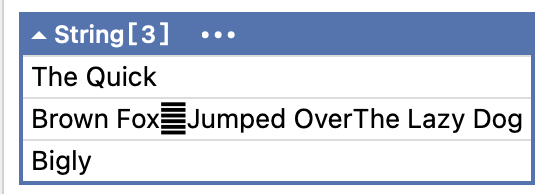
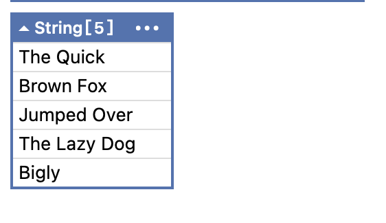

For many years, the bane of developers when it came to processing text was the newline.

For many years there were `3`

- Windows - `\r\n`
- Unix & Linux - `\n`
- Older MacOS = `\r`

Unicode has an additional 3 

-  `\u0085`
-  `\u2028`
-  `\u2029`

Take the following text

```plaintext
var text = "The Quick\r\nBrown Fox\u0085Jumped Over\u2028The Lazy Dog\nBigly";
```

Our challenge is to **extract each line** from this multiline `string`.

Typically, we'd do it like this:

```c#
var oldLines = Regex.Matches(text, @"^.*$", RegexOptions.Multiline).Select(r => r.Value).ToArray();
```

Here our `regular expression`, `^.*$` specifies **anything from start of line to end of line**, and we are telling the engine that our text is, in fact, **MultiLine**.

This outputs the following:



Here we can see that it understood `\r\n` and `n`, but **did not recognize the rest**.

This has been addressed in .NET 11 with the [RegexOptions.AnyNewLine](https://learn.microsoft.com/en-us/dotnet/api/system.text.regularexpressions.regexoptions?view=net-11.0#system-text-regularexpressions-regexoptions-anynewline) flag.

The code can be updated as follows, to pass the new flag:

```c#
var newLines = Regex.Matches(text, @"^.*$", RegexOptions.Multiline | RegexOptions.AnyNewLine).Select(r => r.Value).ToArray();
```

This will return the following:



### TLDR

**The `AnyNewLine` `RegexOptions` flag makes it easier to match text with different newline encodings.**

The code is in my GitHub.

Happy hacking!
