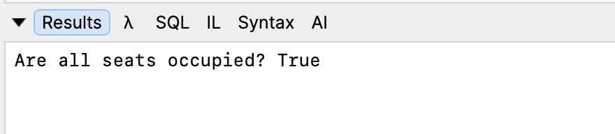
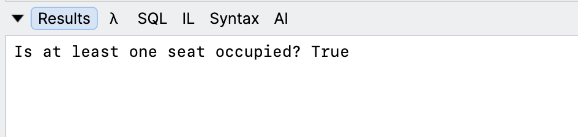

One of the more **esoteric** data structures in the .NET ecosystem is the [BitArray](https://learn.microsoft.com/en-us/dotnet/api/system.collections.bitarray?view=net-10.0).

This is essentially a **collection optimized for working with a large number of boolean values**.

For example, if we wanted to model a **stadium** with `10,000` **seats**, we would do it like so:

```c#
var arr = new BitArray(10_000);
```

We can then set particular seats to be **occupied**, like so:

```c#
arr[1000] = true;
arr[100] = true;
```

You can also use collection initialization like so:

```c#
var arr = new BitArray(10_000)
{
    // Set some of the bits
    [1000] = true,
    [100] = true
};
```

So far, this looks like a normal [array](https://learn.microsoft.com/en-us/dotnet/csharp/language-reference/builtin-types/arrays). What are the **benefits**?

To set all the seats as **occupied**, we would need to **loop** through the `array` elements and set the status.

With a `BitArray` we do it like so:

```c#
// set all seats to be occuped
arr.SetAll(true);
```

We can also **cheaply** check if **all** seats are occupied, using the [HasAllSet](https://learn.microsoft.com/en-us/dotnet/api/system.collections.bitarray.hasallset?view=net-10.0)  like so:

```c#
// Check if all the seats are occupeid
Console.WriteLine($"Are all seats occupied? {arr.HasAllSet()}");
```

This will print the following:



You can also **cheaply** check if **any** of the seats is occupied, using the [HasAnySet](https://learn.microsoft.com/en-us/dotnet/api/system.collections.bitarray.hasanyset?view=net-10.0) method, like so:

```c#
// Check if any seat is occuped
Console.WriteLine($"Is at least one seat occupied? {arr.HasAnySet()}");
```



The challenge usually is to tell **how many seats are occupied**.

Previously, you would need to **loop** to determine this:

```c#
int count = 0;
foreach (bool element in arr)
{
  if (element)
  	count++;
}

Console.WriteLine($"There are {count} seats occupied");
```

In .NET 11, this is simplified using the [PopCount](https://learn.microsoft.com/en-us/dotnet/api/system.collections.bitarray.popcount?view=net-11.0) method.

```c#
Console.WriteLine($"There are {arr.PopCount()} seats occupied");
```

### TLDR

**The `BitArray` class now has a `PopCount` method that you can use to return the number of `true` bits set.**

The code is in my GitHub.

Happy hacking!
