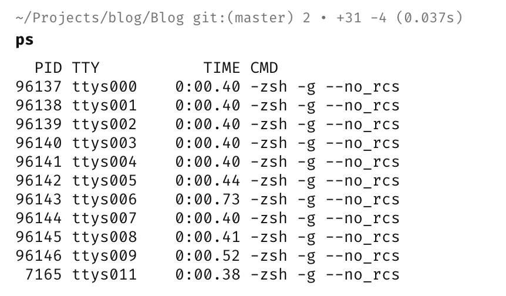
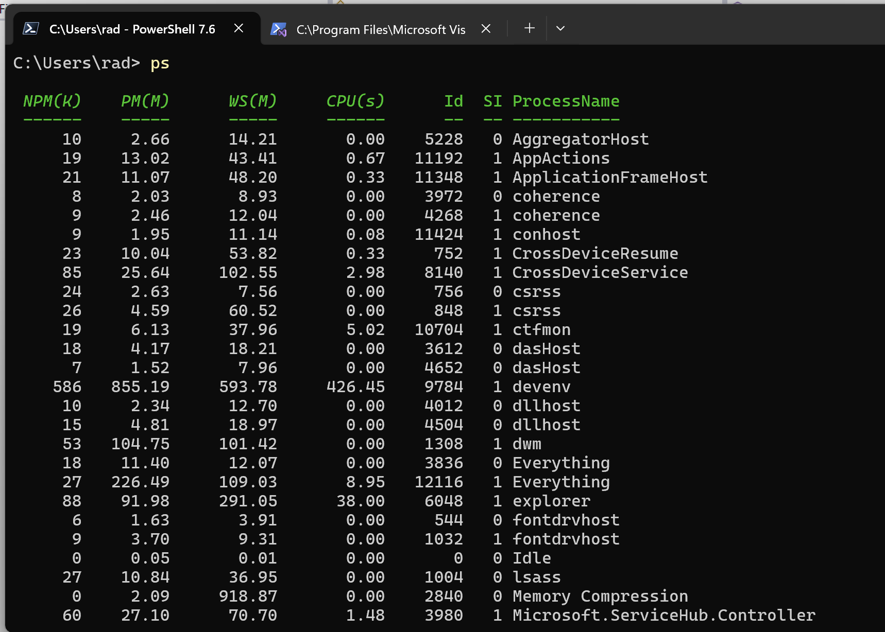
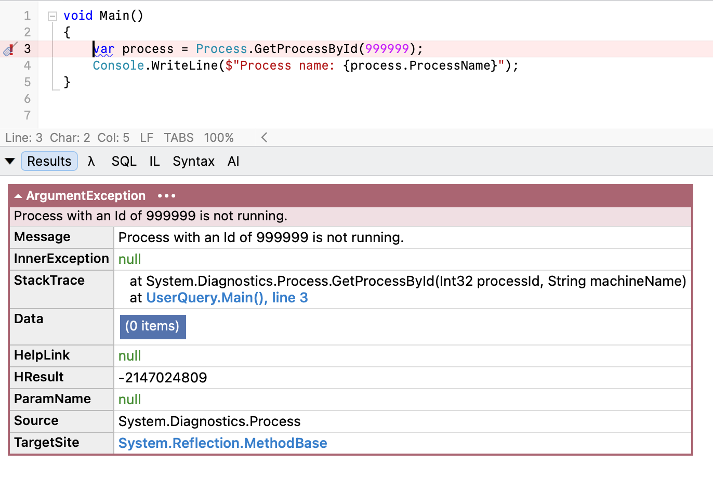

If you want to get information about a [process](https://en.wikipedia.org/wiki/Process_(computing)) and have its [ID](https://en.wikipedia.org/wiki/Process_identifier), you can use the [GetProcessById](https://learn.microsoft.com/en-us/dotnet/api/system.diagnostics.process.getprocessbyid?view=net-10.0) API in the [Process](https://learn.microsoft.com/en-us/dotnet/api/system.diagnostics.process?view=net-10.0) class to fetch it.

You'd typically do it like so:

```c#
var process = Process.GetProcessById(96137);
Console.WriteLine($"Process name: {process.ProcessName}");
```

This will print the following:


You can try this for yourself by listing the current processes using the [ps](https://man7.org/linux/man-pages/man1/ps.1.html) command.

```bash
ps
```

This works with bash (for **Linux**, **Unix**, and **macOS**)



It also works on **Windows** with [PowerShell](https://learn.microsoft.com/en-us/powershell/), where it is an alias for [Get-Process](https://learn.microsoft.com/en-us/powershell/module/microsoft.powershell.management/get-process?view=powershell-7.6).



The problem arises when you try to get a process with a [non-existent ID](), or one you **cannot legitimately get info about**.



If the runtime cannot obtain the process, **it throws an exception**.

Here, I am using the dummy ID of `999999`.

This means you must always wrap your code in a [try-catch block](https://learn.microsoft.com/en-us/dotnet/csharp/language-reference/statements/exception-handling-statements), like so:

```c#
try
{
var process = Process.GetProcessById(99999);
Console.WriteLine($"Process name: {process.ProcessName}");
}
catch (Exception e)
{
Console.WriteLine("Could not load process!");
}
```


In .NET 11, there is a more elegant API for this problem - the `TryGetProcessById` API.  (**As I write this, the official API documentation is yet to be updated for Preview 6)**

This works like so:

```c#
if (Process.TryGetProcessById(99999, out var process))
{
  // Do stuff with our process here
  Console.WriteLine($"Process name: {process.ProcessName}");
}
else
{
  Console.WriteLine("Could not load process!");
}
```

This is much more elegant.

### TLDR

**The new `TryGetProcessById` API allows you to safely try to get process information without requiring exception handling in the case of failure.**

The code is in my [GitHub](https://github.com/conradakunga/BlogCode/tree/master/2026-07-17%20-%20RunningProcesses).

Happy hacking!
