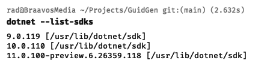
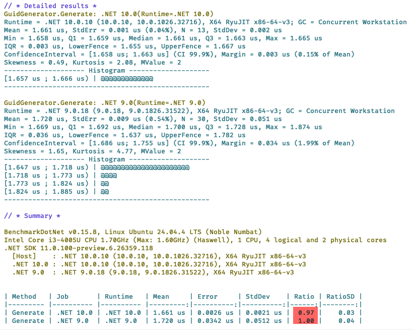

Whenever there is a new release of [.NET](https://dotnet.microsoft.com/), one of the questions that arises is **whether your application is faster or not** when running under the new version.

Which is a sum total of the **collective improvements** across APIs.

Take for example this method:

```c#
Guid.NewGuid();
```

Suppose you want to know how it performs under two different .NET versions, `9` and `10`.

Given that this method is pretty **fast**, a **rudimentary** way is to **generate a large number** of them in a **loop** and **time** that. Compile and run against **.NET 9** and then against **.NET 10**.

But this is cumbersome and unscientific.

A better way is to use the [BenchmarkDotNet](https://benchmarkdotnet.org/) library.

First, we **create** our project.

```bash
dotnet new console -o GuidGen
```

Next, we **install** the library.

```bash
dotnet add package BenchmarkDotNet
```

Next, we change our `.csproj` to tell the compiler we want to target **two versions** of .NET.

```xml
batcat GuidGen.csproj -p
<Project Sdk="Microsoft.NET.Sdk">

  <PropertyGroup>
    <OutputType>Exe</OutputType>
    <TargetFrameworks>net10.0;net90</TargetFrameworks>
    <ImplicitUsings>enable</ImplicitUsings>
    <Nullable>enable</Nullable>
  </PropertyGroup>

  <ItemGroup>
    <PackageReference Include="BenchmarkDotNet" Version="0.15.8" />
  </ItemGroup>

</Project>
```

The magic is happening here:

```xml
<TargetFrameworks>net10.0;net90</TargetFrameworks>
```

For this to work, you must have the SDKs of the versions you intend to run against installed.

You can verify as follows;

```bash
dotnet --list-sdks
```

This should print the following:



Here, you can see I have `3` versions of .NET installed.

Our next order of business is to write our **benchmark**. We typically do this in a `class`, and expose our **benchmark** at a `method` of the `class`, which tells the **runner** what exactly we are benchmarking.

```c#
public class GuidGenerator
{
	[Benchmark]
public Guid Generate() => Guid.NewGuid();
}
```

Here, we can see what we are benchmarking is the `Generate()` method.

Next, we indicate that we want to benchmark our code across .NET versions. This is achieved using the `SimpleJob` attribute, specifying the **version** we want using the `RuntimeMoniker` as appropriate.

```c#
[SimpleJob(RuntimeMoniker.Net10_0)]
[SimpleJob(RuntimeMoniker.Net90)]
public class GuidGenerator
{
    [Benchmark]
    public Guid Generate() => Guid.NewGuid();
}
```

Additionally, we typically want to indicate what we consider the **baseline** against which **comparisons** are run.

In this case, since we want to know if performance has **improved**, we set the baseline to .**NET 9** by indicating the same in the **attribute**.

```c#
[SimpleJob(RuntimeMoniker.Net10_0)]
[SimpleJob(RuntimeMoniker.Net90, baseline: true)]
public class GuidGenerator
{
  [Benchmark]
  public Guid Generate() => Guid.NewGuid();
}
```

Finally, in the main program, we wire the **benchmark runner**, like so:

```c#
BenchmarkRunner.Run<GuidGenerator>();
```

We are calling the generic static `Run` method of the `BenchmarkRunner`, telling it the `class` containing our **Benchmark**.

Finally, we run our benchmarks like so:

```bash
dotnet run -c Release
```

You must run in the [release configuration](https://learn.microsoft.com/en-us/dotnet/core/tools/dotnet-build) - it will literally **not run** if you don't specify as much.

If all goes well, you should see the following at the bottom of a lot of generated **results**:



Here we can see that the method in **.NET 10** is `3%` **faster** than **.NET 9**.

You can also see I am running this benchmark on Ubuntu Linux 24.04 on a machine with 1 CPU, 2 physical and 4 logical cores.

### TLDR

**`BenchmarkDot` net allows you to compare performance across .NET versions using the `Benchmark` attribute.**

The code is in my GitHub.

Happy hacking!
