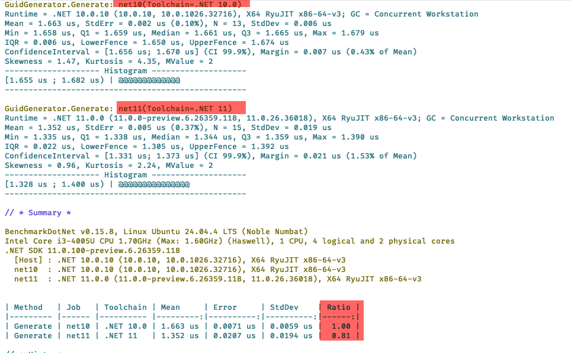

Yesterday's post, "[How to Benchmark Performance Across .NET Versions]()", looked at how to compare the **performance** of code across .NET versions using the [BenchmarkDotNet](https://benchmarkdotnet.org/articles/overview.html) library.

It hinged on decorating the `class` hosting the benchmark with the `SimpleJob` [attribute](https://medium.com/@payton9609/attributes-in-c-cccb57a3f42b), which we use to specify the .NET version we want to run against using the `RuntimeMoniker` [enum](https://medium.com/@sweetondonie/enums-in-c-a-beginners-guide-to-smarter-safer-code-cd3374786bbe).

```c#
[SimpleJob(RuntimeMoniker.Net10_0)]
[SimpleJob(RuntimeMoniker.Net90, baseline: true)]
public class GuidGenerator
{
  [Benchmark]
  public Guid Generate() => Guid.NewGuid();
}
```

This, however, presents a challenge: **BenchmarkDotNet** needs to know about the .NET versions you want to test against beforehand.

What happens, as is the case now, when **BenchmarkDotNet** **doesn't know about the version we want to benchmark** - .NET 11? 

There is no `RuntimeMoniker.NET11_0`. At least not yet.

So what do we do in this situation?

Luckily, there is a solution.

You need to subclass the `ManualConfig` class and, within your implementation, specify the **frameworks you want included** in the constructor, as follows:

```c#
public sealed class BenchmarkConfig : ManualConfig
{
    public BenchmarkConfig()
    {
        // This is normal .NET 10
        AddJob(
            Job.Default
                .WithToolchain(
                    CsProjCoreToolchain.From(NetCoreAppSettings.NetCoreApp10_0))
                .WithId("net10")
                .AsBaseline());

        // This is .NET 11
        AddJob(
            Job.Default
                .WithToolchain(
                    CsProjCoreToolchain.From(
                        new NetCoreAppSettings(
                            targetFrameworkMoniker: "net11.0",
                            runtimeFrameworkVersion: null,
                            name: ".NET 11")))
                .WithId("net11"));
    }
}
```

Next, we decorate our **Benchmark** class with a typed `Config` attribute of our `class`, like so:

```c#
[Config(typeof(BenchmarkConfig))]
public class GuidGenerator
{
    [Benchmark]
    public Guid Generate() => Guid.NewGuid();
}
```

This will instruct our benchmark **runner** how to find and launch the desired .NET versions.

Now, we can run the benchmark.

```bash
dotnet run -c=Release
```



Here we can see a couple of things:

1. The runner was able to load **both toolchains** - .NET 10 and .NET 11
2. It was able to **benchmark both** versions
3. [Guid](https://learn.microsoft.com/en-us/dotnet/api/system.guid?view=net-10.0) generation is 20% **faster** in .NET 11 compared to .NET 10.

### TLDR

**You can run benchmarks against .NET versions *BenchmarkDotNet* is unaware of by subclassing and implementing the `ManualConfig` class.**

The code is in my GitHub.

Happy hacking!
