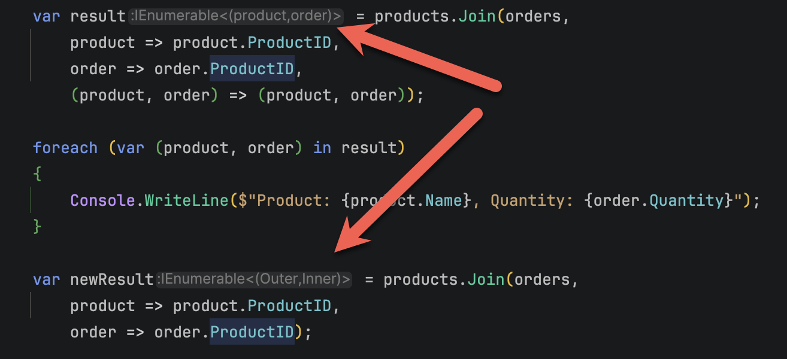

A staple of .NET programming is the use of [LINQ](https://learn.microsoft.com/en-us/dotnet/csharp/linq/) to **simplify** a lot of **common operations**.

`LINQ` also offers the ability to [join](https://learn.microsoft.com/en-us/dotnet/csharp/linq/standard-query-operators/join-operations) data, and perform a **variety** of operations.

Take, for example, the following `type` for a `Product`:

```c#
public class Product
{
	public required int ID { get; init; }
	public required string Name { get; init; }
}
```

Let us add another type, an `Order`:

```c#
public class Order
{
	public required int OrderID { get; init; }
	public required int ProductID { get; init; }
	public required int Quantity { get; init; }

```

We then create a [collection](https://learn.microsoft.com/en-us/dotnet/csharp/language-reference/builtin-types/collections) of `Product`:

```c#
Product[] products = [
  new Product { ID = 1, Name = "Mango" },
  new Product { ID = 2, Name = "Banana" },
  new Product { ID = 3, Name = "Potato" },
  new Product { ID = 4, Name = "Cabbage" },
];
```

And another `collection` of `Order`:

Suppose we wanted to **iterate** over all the orders and print the `Product` **name** and **quantity**. We can achieve this using a `LINQ` `JOIN`, like this:

```c#
var result = products.Join(orders,
		product => product.ProductID,
		order => order.ProductID,
		(product, order) => (product, order));
```

This would [project](https://learn.microsoft.com/en-us/dotnet/csharp/linq/standard-query-operators/projection-operations) the result of **each join operation** into a [tuple](https://learn.microsoft.com/en-us/dotnet/csharp/language-reference/builtin-types/value-tuples) that we can **iterate** over, like this:

```c#
foreach (var (product, order) in result)
{
	Console.WriteLine($"Product: {product.Name}, Quantity: {order.Quantity}");
}
```

This will print the following:

```plaintext
Product: Mango, Quantity: 10
Product: Banana, Quantity: 13
Product: Potato, Quantity: 5
Product: Cabbage, Quantity: 8
```


Note that there is some **ceremony**, including generation of an **intermediate** resultset of `tuples`:

```c#
var result = products.Join(orders,
		product => product.ProductID,
		order => order.ProductID,
		(product, order) => (product, order));
```

This has been simplified in .NET 11.

We can get the exact same result like this:

```c#
var newResult = products.Join(orders,
		product => product.ProductID,
		order => order.ProductID);
```

Note here we **do not need to construct** our `tuple` in advance, and that the **generated data structure being returned is identical** in both cases:



### TLDR

**Projection of `LINQ` `JOIN` results is simplified in .NET 11**

The code is in my [GitHub](https://github.com/conradakunga/BlogCode/tree/master/2026-07-24%20-%20SimpleJoin).

Happy hacking!
