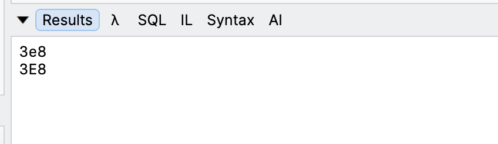
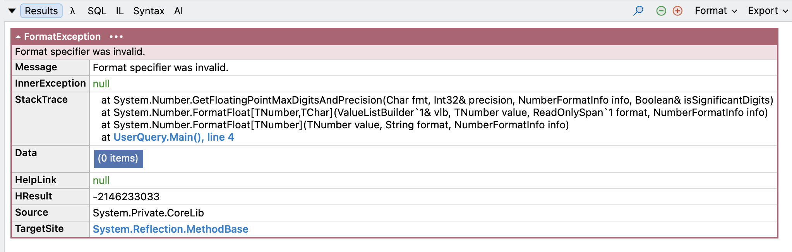
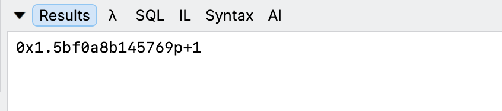

**Fomatting** of numbers as [hexadecimal](https://en.wikipedia.org/wiki/Hexadecimal) has been possible in .NET for quite some time.

You do it like this:

```c#
Console.WriteLine(1_000.ToString("x"));
```

This will print the following:

```plaintet
7b
```

If you want it in **uppercase**, you do it like this:

```c#
Console.WriteLine(1_000.ToString("X"));
```

The difference here is the **format specifier** - `x` (small) vs `X` (capital).



You might wonder, is it possible to display **fractional numbers** in the same way.

It is not.

You will get an [FormatException](https://learn.microsoft.com/en-us/dotnet/api/system.formatexception?view=net-10.0), complaining about an **invalid format**.



That is, it was not until .NET 11.

You can now display fractional numbers in **hex**.

Take, for example, `e` - the [natural log](https://en.wikipedia.org/wiki/Natural_logarithm).

```c#
var natruralLog = Math.E;
Console.WriteLine(natruralLog.ToString("x"));
```

This will print the following:



You can also write the code like this:

```c#
Console.WriteLine($"{natruralLog:x}");
```

### TLDR

You can now format fractional numbers as hex in .NET 11

Happy hacking!
