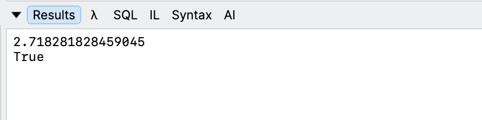

Yesterday's post, "[.NET 11 Preview - Formatting Floating Point Numbers In Hex]()", looked at how to **format fractional numbers** in [hex](https://en.wikipedia.org/wiki/Hexadecimal), that is now possible in .NET 11.

```c#
var natruralLog = Math.E;
Console.WriteLine(natruralLog.ToString("x"));
```

In this post, we will look at the **reverse** - retrieving the **numerical fractional value** from its **hex** representation.

First, we obtain the `hexValue` as a `string`:

```c#
var hexValue = natruralLog.ToString("x");
```

Next, we **parse** the value back to a **number**:

```c#
var number = double.Parse(hexValue, NumberStyles.HexFloat);
```

Here we are using the [double.Parse](https://learn.microsoft.com/en-us/dotnet/api/system.double.parse?view=net-10.0) method in conjunction with the [NumberStyles.HexFloat](https://learn.microsoft.com/en-us/dotnet/api/system.globalization.numberstyles?view=net-11.0) `enum` in the [System.Globaization](https://learn.microsoft.com/en-us/dotnet/api/system.globalization?view=net-11.0) namespace, that instructs **how** to **parse** the `string`.

We can then **verify** that our **original** number is **equal** to the **parsed** number.

```c#
// Print number
Console.WriteLine(number);

// Verify parity
Console.WriteLine(number == natruralLog);
```

This will display the following:



We can see here that our value was **successfully round-tripped**.

### TLDR

**Fractional numbers formatted as *hex* can be round-tripped successfully with preserved accuracy.**

The code is in my GitHub.

Happy hacking!
