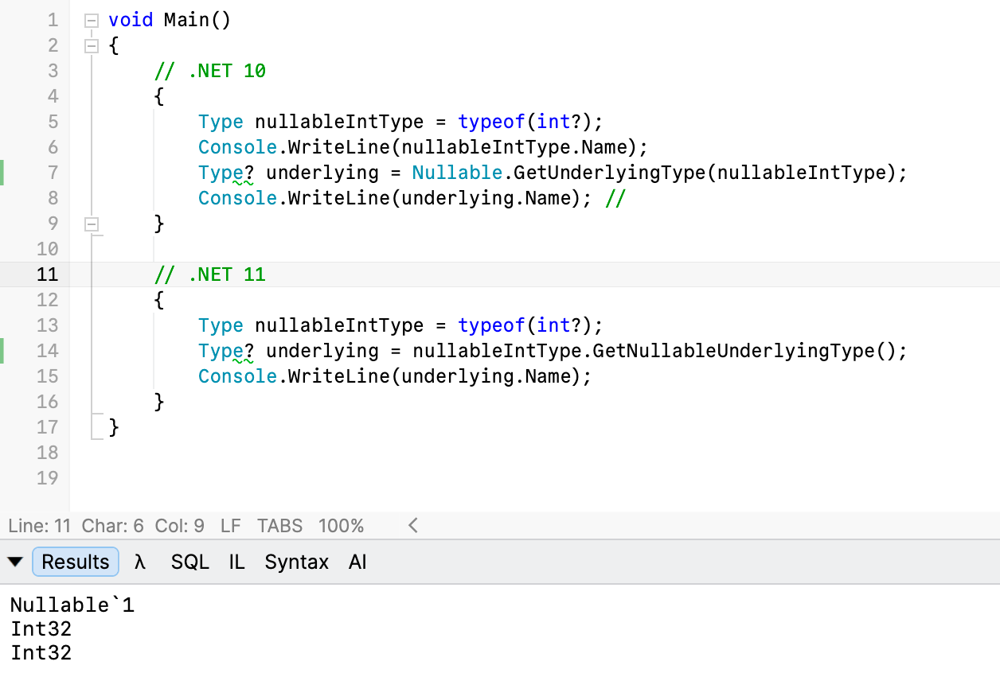

[Nullable types](https://learn.microsoft.com/en-us/dotnet/csharp/language-reference/builtin-types/nullable-value-types) have a lot of benefits when it comes to articulating **system design**.

However, obtaining information about a `nullable type` is generally quite an exercise.

Take this example: a `nullable` [int](https://learn.microsoft.com/en-us/dotnet/csharp/language-reference/builtin-types/integral-numeric-types).

```c#
typeof(int?);
```

If we wanted to get some information about it, we would do it like this:

```c#
Type nullableIntType = typeof(int?);

Console.WriteLine(nullableIntType.Name);
```

This prints the rather unhelpful:

```plaintext
Nullable`1
```

To get what it is requires a bit more **work**:

```c#
Type? underlying = Nullable.GetUnderlyingType(nullableIntType);
Console.WriteLine(underlying.Name)
```

We need to call the [GetUnderlyingType](https://learn.microsoft.com/en-us/dotnet/api/system.nullable.getunderlyingtype?view=net-10.0) method from the [Nullable](https://learn.microsoft.com/en-us/dotnet/api/system.nullable?view=net-10.0) `class`.

This now prints what we **expect**:

```plaintext
Int32
```

This has been improved in .NET 11, where the [Type](https://learn.microsoft.com/en-us/dotnet/api/system.type?view=net-11.0) class has gained this functionality **directly** via the new [GetNullableUnderlyingType](https://learn.microsoft.com/en-us/dotnet/api/system.type.getnullableunderlyingtype?view=net-11.0) method.

The code is now more **direct**:

```c#
Type nullableIntType = typeof(int?);
Type? underlying = nullableIntType.GetNullableUnderlyingType();
Console.WriteLine(underlying.Name);
```



### TLDR

**You can now interrogate the Type directly to get information about the underlying type for nullable types.**

The code is in my GitHub.

Happy hacking!
