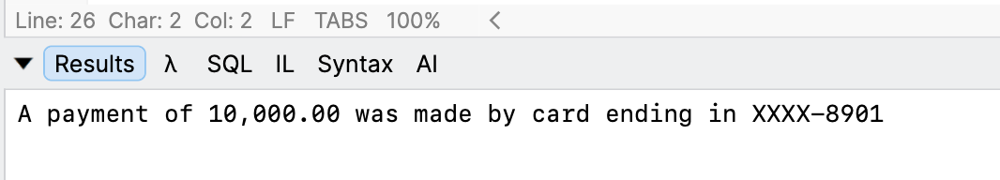
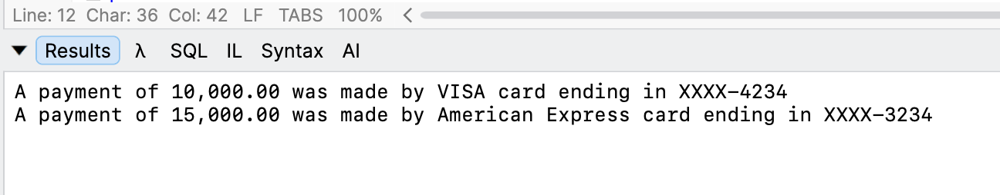

This is **Part 1** of a series on **Discriminated Unions**.

In this post, we will start to look at the concept of discriminated unions and how they **elegantly** solve `type` **design problems**.

For this, we will use a **practical example** and work our way up from there.

Take a problem domain where you need to model [card payments](https://stripe.com/resources/more/card-payments).

We can model our card, `Card`, like this:

```c#
public sealed class Card
{
  public required string Number { get; init; }
  public required string CVV { get; init; }
  public required string CardHolderName { get; init; }
}
```

We also need to model a **payments processor**, `PaymentProcessor`.

```c#
public static class PaymentsProcessor
{
  public static void MakePayment(Card card, decimal Amount)
  {
  	Console.WriteLine($"A payment of {Amount:#,0.00} was made by card ending in XXXX-{card.Number[^4..]}");
  }
}
```

We then create a `Card`, like this:

```c#
var card = new Card
{
  Number = "0123-4567-8901",
  CardHolderName = "Conrad Akunga",
  CVV = "342"
};
```

We then use it like this:

```c#
// Make a payment with the card
PaymentsProcessor.MakePayment(card, 10_000);
```

This should print the following:



So far, so good.

Now suppose this was a [VISA](https://www.visa.com/en-us) card, and [American Express](https://www.americanexpress.com/) has entered the market.

**VISA** has a `3`-digit [CVV](https://www.cvvnumber.com/), and **American Express** has a `4`-digit **CVV**.

Further, our `PaymentsProcessor` needs to be aware of **each card type**.

We have two options here:

1. Create `2` different `types` to capture this reality
2. Adapt the `PaymentProcessor` to handle the **different card types**.

Like so:

```c#
public sealed class VisaCard
{
  public required string Number { get; init; }
  public required string CVV { get; init; }
  public required string CardHolderName { get; init; }
}
```

And like so:

```c#
public sealed class AmericanExpressCard
{
  public required string Number { get; init; }
  public required string CVV { get; init; }
  public required string CardHolderName { get; init; }
}
```

Our `PaymentProcessor` now looks like this:

```c#
public static class PaymentsProcessor
{
  public static void MakePayment(VisaCard card, decimal Amount)
  {
	Console.WriteLine($"A payment of {Amount:#,0.00} was made by VISA card ending in XXXX-{card.Number[^4..]}");
  }
  public static void MakePayment(AmericanExpressCard card, decimal Amount)
  {
	Console.WriteLine($"A payment of {Amount:#,0.00} was made by AMEX card ending in XXXX-{card.Number[^4..]}");
  }
}
```

You can see in this approach that there is a lot of **duplication**.

Plus, is there really that much of a **difference** between the two cards?

Suppose we **unified the cards** like this: first, a base abstract class:

```c#
public abstract class Card
{
  public required string Number { get; init; }
  public abstract string Type { get; }
  public required string CVV { get; init; }
  public required string CardHolderName { get; init; }
}
```

Here, we have added a new property, `Type`, to easily label the cards.

Then a **VISA** implementation:

```c#
public class VisaCard : Card
{
	public override string Type => "VISA";
}
```

Then, an **American Express** implementation:

```c#
public class AmericanExpressCard : Card
{
	public override string Type => "American Express";
}
```

Finally, we update our `PaymentProcessor`:

```c#
public static class PaymentsProcessor
{
  public static void MakePayment(Card card, decimal Amount)
  {
    switch (card)
    {
      case VisaCard:
      	Console.WriteLine($"A payment of {Amount:#,0.00} was made by VISA card ending in XXXX-{card.Number[^4..]}");
      	break;
      case AmericanExpressCard:
      	Console.WriteLine($"A payment of {Amount:#,0.00} was made by American Express card ending in XXXX-{card.Number[^4..]}");
      	break;
    }
  }
}
```

We use it like this:

```c#
var amex = new AmericanExpressCard
{
  CardHolderName = "Conrad Akunga",
  CVV = "3423",
  Number = "0100-3224-2344-23234"
};

var visa = new VisaCard
{
  CardHolderName = "Conrad Akunga",
  CVV = "45354",
  Number = "1234-5678-9190-34234"
};

PaymentsProcessor.MakePayment(visa, 10_000);
PaymentsProcessor.MakePayment(amex, 15_000);
```

This will print the following:



So far so good.

Now imagine the entry of a new card type - the **Safiri Card**.

This one does not have a `CVV` at all.

This **complicates** our design based on this base type:

```c#
public abstract class Card
{
  public required string Number { get; init; }
  public abstract string Type { get; }
  public required string CVV { get; init; }
  public required string CardHolderName { get; init; }
}
```

And then, as is the case in my home country, **Kenya**, there is a new player - [mobile money](https://www.m-pesa.africa/). This is **not a card at all**.

In our next post, we will look at how to tackle this.

### TLDR

**`Type` design can start off well and quickly become complicated.**

The code is in my GitHub.

Happy hacking!
