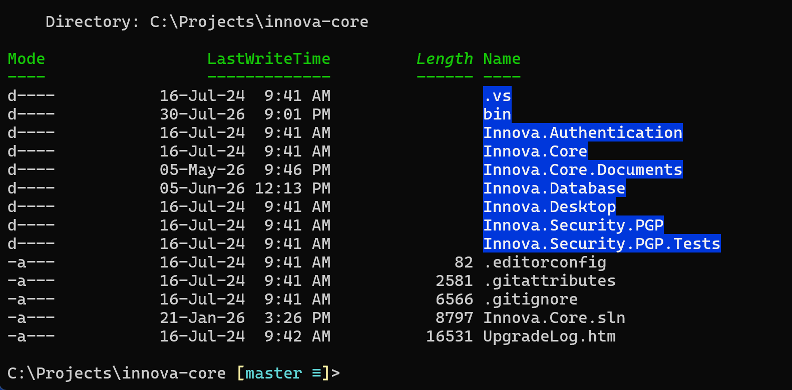
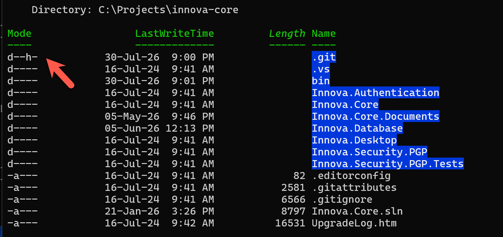

Generally, when you list files in [PowerShell](https://learn.microsoft.com/en-us/powershell/), you get, by default, only the **non-hidden** files.

The same applies to **directories**.

For example, if you run `ls` in a directory, you will get something like this:



If you want to see the **hidden** folders, pass the `-h` argument

```bash
ls -h
```



We can see here from the `Mode` column that the `.git` folder is actually a **hidden** folder.

Happy hacking!
