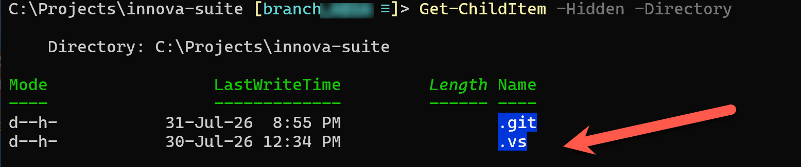

Recently, I ran into a problem where [Visual Studio](https://visualstudio.microsoft.com/) was stuck in a **loop**, continuously **restarting** after trying to open a solution.

As usual, there was nothing in particular I had done to the solution to warrant this.

The solution to this is simple.

Visual Studio maintains a **hidden directory** where it stores **intermediate data** to do with managing solutions and projects as you work on them.

The directory is named `.vs`.

You can view this using the following command:

```bash
ls -Hidden -Folder
```

This will show something like this:



To resolve the continuously restarting issue, **delete the `.vs` folder**.

This will **reset the solution**, including what you had set as the **startup** project.

### TLDR

**If Visual Studio is continuously restarting after opening a project, delete the `.vs` folder.**

Happy hacking!
