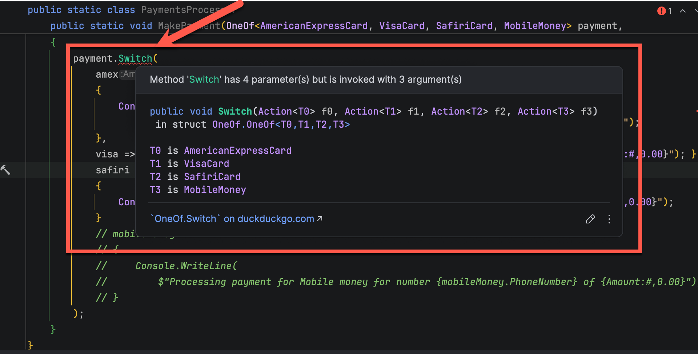
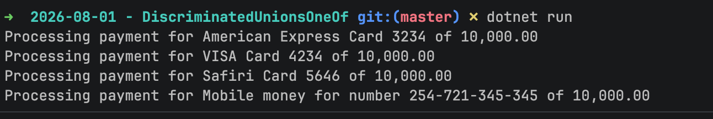

This is **Part 1** of a series on **Discriminated Unions**.

- [Part 1 - Introduction]()
- **Part 2 - Implementation (this post)**

In our [previous post in the series](), we saw how we can start off with a design based on model [inheritance](https://learn.microsoft.com/en-us/dotnet/csharp/fundamentals/object-oriented/inheritance) that can quickly outrun the capabilities of **inheritance**.

In particular, we saw how evolution of the model from this **base** class:

```c#
public abstract class Card
{
  public required string Number { get; init; }
  public abstract string Type { get; }
  public required string CVV { get; init; }
  public required string CardHolderName { get; init; }
}
```

And these **concrete** classes:

```c#
public class VisaCard : Card
{
  public override string Type => "VISA";
}
```

And:

```c#
public class AmericanExpressCard : Card
{
  public override string Type => "American Express";
}
```

Quickly ran into problems where we were presented with payment types that do not fit this model:

1. SafarCard - **no CVV**
1. Mobile money - **not a card at al**l.

On top of the complications of modeling the payment types, one of the biggest consequences is on the `PaymentProcessor`.

It currently looks like this:

```c#
public static class PaymentsProcessor
{
  public static void MakePayment(Card card, decimal Amount)
  {
    switch (card)
    {
      case VisaCard:
      	Console.WriteLine($"A payment of {Amount:#,0.00} was made by VISA card ending in XXXX-{card.Number[^4..]}");
      	break;
      case AmericanExpressCard:
      	Console.WriteLine($"A payment of {Amount:#,0.00} was made by American Express card ending in XXXX-{card.Number[^4..]}");
      	break;
    }
  }
}
```

The signature of the `MakePayment` method is as follows:

```c#
public static void MakePayment(Card card, decimal Amount)
```

Given that `Card` no longer fits our requirements, what do we do?

We could do it this way:

```c#
public static void MakePayment(Object paymentMethod, decimal Amount)
```

Here we refactor from `Card` to `Object`.

The problem with this approach is that it will be a nightmare to **develop**, **test** and **maintain**, because **anything** can be passed as this object, by accident or by design.

So how do we solve this?

What if there was a way to tell the method the following:

> I am going to pass you something of a type `PaymentMethod`. This could be one of the following:
>
> 1. A known credit card (Visa, American Express, Master Card)
> 2. New credit cards (SafiriPay)
> 3. Mobile Money

From this we can see the type is potentially **one of three different types**.

Within its logic, the `PaymentProcessor` will know how to handle **each one**.

We accomplish this as follows:

First, we **redesigned** our `types` and move away from [abstract classes](https://en.wikipedia.org/wiki/Abstract_type) and use [interfaces](https://learn.microsoft.com/en-us/dotnet/csharp/fundamentals/types/interfaces) instead to specify contracts.

We start with the base level `ICard`:

```c#
public interface ICard
{
    public string Number { get; init; }
    public string Type { get; }
    public string CardHolderName { get; init; }
}
```

We next define the `IKnownCard` interface, that extends `ICard`:

```c#
public interface IKnownCard : ICard
{
    public string CVV { get; init; }
}
```

Next we **implement** our cards:

`AmericanExpress`:

```c#
public sealed class AmericanExpressCard : IKnownCard
{
    public required string Number { get; init; }
    public string Type => "American Express";
    public required string CardHolderName { get; init; }
    public required string CVV { get; init; }
}
```

`Visa`:

```c#
public sealed class VisaCard : IKnownCard
{
    public required string Number { get; init; }
    public string Type => "VISA";
    public required string CardHolderName { get; init; }
    public required string CVV { get; init; }
}
```

`Safiri`:

```c#
public sealed class SafiriCard : ICard
{
    public required string Number { get; init; }
    public string Type => "Safiri";
    public required string CardHolderName { get; init; }
}
```

Then a new type to support mobile money:

```c#
public sealed class MobileMoneyPayment
{
    public required string PhoneNumber { get; init; }
    public required string Name { get; init; }
}
```

Finally, we turn to our `PaymentProcessor`.

As outlined earlier, we could do it this way:

```c#
public static void MakePayment(Object paymentMethod, decimal Amount)
```

But this presents a lot more **problems** than solutions.

We also don't want to provide [overloads](https://learn.microsoft.com/en-us/dotnet/csharp/fundamentals/types/interfaces) for all the **payment types**.

So how do we pass, what is essentially an **optional** type?

We add the library [OneOf](https://github.com/mcintyre321/OneOf/) from [Nuget](https://www.nuget.org/packages/oneof/).

```bash
dotnet add package OneOf
```

Then we write our `PaymentProcessor` like this:

```c#
public static class PaymentsProcessor
{
    public static void MakePayment(OneOf<AmericanExpressCard, VisaCard, SafiriCard, MobileMoneyPayment> payment,
        decimal Amount)
    {
        payment.Switch(
            amex =>
            {
                Console.WriteLine(
                    $"Processing payment for American Express Card {amex.Number[^4..]} of {Amount:#,0.00}");
            },
            visa => { Console.WriteLine($"Processing payment for VISA Card {visa.Number[^4..]} of {Amount:#,0.00}"); },
            safiri =>
            {
                Console.WriteLine($"Processing payment for Safiri Card {safiri.Number[^4..]} of {Amount:#,0.00}");
            },
            mobileMoney =>
            {
                Console.WriteLine(
                    $"Processing payment for Mobile money for number {mobileMoney.PhoneNumber} of {Amount:#,0.00}");
            }
        );
    }
}
```

A couple of things to point out:

1. The `MakePayment` method takes as a **parameter** an object of `type` [OneOf<AmericanExpressCard, VisaCard, SafiriCard, MobileMoneyPayment>](), which specifies all the `PaymentTypes` we intend to handle.
2. Within the `MakePayment` method, we switch over all the possible `PaymentTypes`
3. We provide logic for **each candidate** of `PaymentType` specified in the `type`

The last part is key. **If you fail to provide logic for each branch, you will get a compiler error**.



Here, I have **commented** out one branch, `MobileMoney` and a compiler error has been generated.

We can then try some transactions:

```c#
var amex = new AmericanExpressCard
{
    CardHolderName = "Conrad Akunga",
    CVV = "3423",
    Number = "0100-3224-2344-23234"
};

PaymentsProcessor.MakePayment(amex, 10_000);

var visa = new VisaCard
{
    CardHolderName = "Conrad Akunga",
    CVV = "45354",
    Number = "1234-5678-9190-34234"
};
PaymentsProcessor.MakePayment(visa, 10_000);

var safiri = new SafiriCard
{
    Number = "2343-3423-2342-5646",
    CardHolderName = "Conrad Akunga",
};
PaymentsProcessor.MakePayment(safiri, 10_000);

var mpesa = new MobileMoneyPayment
{
    PhoneNumber = "254-721-345-345",
    Name = "Conrad Akunga"
};

PaymentsProcessor.MakePayment(mpesa, 10_000);
```

This will print the following:



In this fashion we can pass our method **completely unrelated types** encapsulated into a **parameter**.

This is called a [discriminated union](https://en.wikipedia.org/wiki/Tagged_union), and has for quite some time been available in functional languages like [F#](https://fsharp.org/), [OCAML](https://ocaml.org/) & [Haskell](https://www.haskell.org/).

**Extensibility** is simpler and much more **maintainable** as if we need to support a new `PaymentType`, we can simply add that type to the `OneOf` **parameter**.

In our next post in the series, we will look at how to use this to solve some common programming problems.

### TLDR

**Discriminated union allow for the elegant and type-safe solution to the problem where we need to pass unrelated `types` to methods.**

The code is in my [GitHub](https://github.com/conradakunga/BlogCode/tree/master/2026-08-01%20-%20DiscriminatedUnionsOneOf).

Happy hacking!
