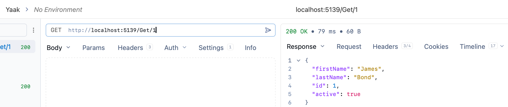
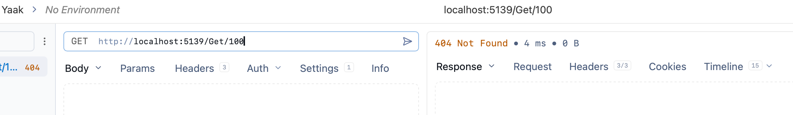

This is **Part 3** of a series on **Discriminated Unions**.

- [Part 1 - Introduction]()
- [Part 2 - Implementation]()
- **Part 3 - Practical Uses (this post)**

In our [previous post](), we looked at how to implement [discriminated unions](https://en.wikipedia.org/wiki/Tagged_union) in a way to support a model of payments, where a `PaymentProcessor` can handle different types of **payments**..

In this post, we will look at an **elegant** solution to handle a common problem - implementing an endpoint that **fetches an entity by ID**.

This we will implement in a simple ASP.NET project.

First, a simple `type` to hold our entity, a `Person`.

```c#
public sealed record Person(string FirstName, string LastName, int ID, bool Active);
```

Then, our [minimal API](https://minimal-apis.github.io/) to search this.

```c#
var builder = WebApplication.CreateBuilder(args);

// Create a dummy 'database' in memory
List<Person> people =
[
    new Person("James", "Bond", 1, true),
    new Person("Evelyn", "Salt", 2, true),
    new Person("Jason", "Bourne", 3, true),
    new Person("Modesty", "Blaise", 4, false),
    new Person("Harry", "Pearce", 5, true),
];

// Register database
builder.Services.AddSingleton(people);

var app = builder.Build();

// Setup end point
app.MapGet("/Get/{id:int}", (List<Person> people, int id) =>

{
    var person = people.SingleOrDefault(x => x.ID == id);
    // If person is not found, return Http 401
    if (person is null)
    {
        return Results.NotFound();
    }

    // Return found person
    return Results.Ok(person);
});

app.Run();
```

We can then test this out, using [Yaak](https://yaak.app/), my tool of choice:

If **successful**:



If **unsuccessful**:



Here, there are two possibilities:

1. We **found** our `Person`
2. We **didn't find** our `Person`

There is a bunch of other possibilities:

1. The `Person` was found, but is **inactive**
2. There was a **database error** of some sort
3. There is a **network error** of some sort

In other words, there are other outcomes, some that are **relevant** to the problem domain, and those the are **not**.

We can express our **possibilities** as follows:

1. **Found**, and **active** - the success path
2. **Found**, but **not active**
3. **Not** Found
4. Some sort of **error** occurred

This is a good candidate to use **discriminated unions**.

We can model the following additional `types`:

```c#
// Type to express no result was returned
public sealed record NotFound;

// Type to express Person was found, but inactive
public sealed record FoundInactive(Person person);

// Type to express some sort of problem was encountered
public sealed record Problem(string Details);
```

We then introduce a **service** to which we **delegate the fetch**:

```c#
public sealed class Searcher
{
    public static OneOf<Person, FoundInactive, NotFound, Problem> Find(List<Person> people, int id)
    {
        try
        {
            // Randomly throw an exception
            if (Random.Shared.Next(0, 2) < 1)
                return new Problem("Random error");
            // Try and find the person
            var person = people.SingleOrDefault(x => x.ID == id);
            // Not found
            if (person is null)
                return new NotFound();
            // Found, but with caveats
            return person.Active switch
            {
                // Active, normal result
                true => person,
                // Inactive, edge case result
                false => new FoundInactive(person)
            };
        }
        catch (Exception e)
        {
            // Some other exception. Return this too
            return new Problem(e.Message);
        }
    }
}
```

In our `Searcher`, we are making use of the `OneOf` package to have a discriminated union as a **return type**, where we return each of the possible scenarios.

Finally, our API simply **matches** agains the return types:

```c#
// Setup end point
app.MapGet("/Get/{id:int}", (List<Person> injectedPeople, int id) =>
{
    return Searcher.Find(injectedPeople, id).Match(
        person => Results.Ok(person),
        inactive => Results.UnprocessableEntity(inactive),
        notFound => Results.NotFound(),
        problem => Results.Problem(problem.Details)
    );
});
```

Here we can see that the API code is very **minimal** - just choosing how to render the response depending on the **returned** `type`.

This can be further **simplified** as follows:

```c#
// Setup end point
app.MapGet("/Get/{id:int}", (List<Person> injectedPeople, int id) =>
{
    return Searcher.Find(injectedPeople, id).Match(
        Results.Ok,
        Results.UnprocessableEntity,
        _ => Results.NotFound(),
        problem => Results.Problem(problem.Details)
    );
});
```

But I find this **difficult to read**. I prefer the former, more explicit expression.

With this design, you are forced to decide up from what are the return types you are expecting, and write your code around these.

### TLDR

**Discriminated unions lend themselves well to domain design, where we upfront come up with the possible states we are expecting from our systems.**

The code is in my GitHub.

Happy hacking!
