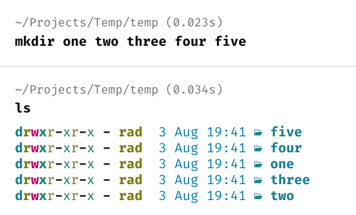
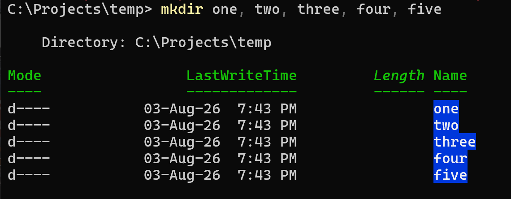

Suppose we needed to create the following **directories** in our current path:

- `One`
- `Two`
- `Three` 
- `Four` 
- `Five`

Typically, we'd do it like this:

```bash
mkdir one
mkdir two
mkdir three
mkdir four
mkdir five
```

This works, but requires a lot of **repetitive typing**.

We can get the same result as follows:

```bash
mkdir one two three four five
```

Here we are passing the names of all the directories that we want to the [mkdir](https://en.wikipedia.org/wiki/Mkdir) command.



This trick, however, does not work in [PowerShell](https://learn.microsoft.com/en-us/powershell/).

For it to work, you must separate the entries with a **comma**.

```powershell
mkdir one, two, three, four, five
```



### TLDR

**The `mkdir` command can create multiple directories in a single line.**

Happy hacking!
