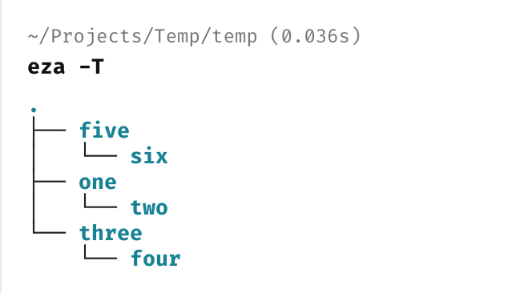

In our previous post, "[Creating Multiple Directories In The Terminal]()", we looked at how to **create multiple directories** in the terminal in **one command**.

But what if we have a more **exotic** requirement?

We want to create this structure:


This is `3` directories, each with a **child** directory.

- One
    - Two
- Three
    - Four
- Five
    - Six

Doing this the **hard way** would require a lot of **command-line kung fu** - `mkdir`, `cd`, `mkdir`, `cd ..`

Mercifully, it is possible to create this structure in a **single** `mkdir` command using the [-p](https://linux.die.net/man/1/mkdir) flag, which **creates parents as needed**.

We can thus run the following command:

```bash
mkdir -p one/two three/four five/six
```

If you are wondering how I got the **tree** displayed above, that is courtesy of [eza](https://eza.rocks/).

The actual command is:

```c#
eza -T
```



### TLDR

**You can create nested directories using the `mkdir` command with the `-p` flag.**

Happy hacking!
