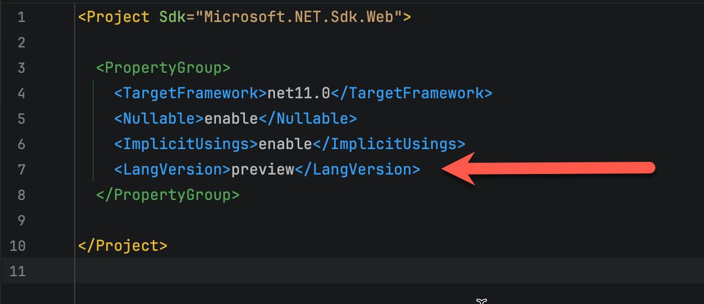
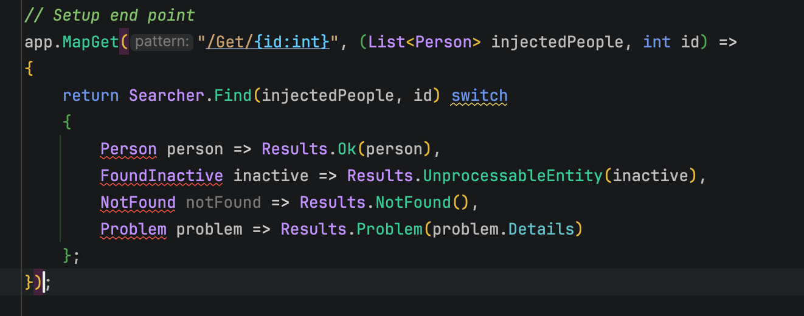
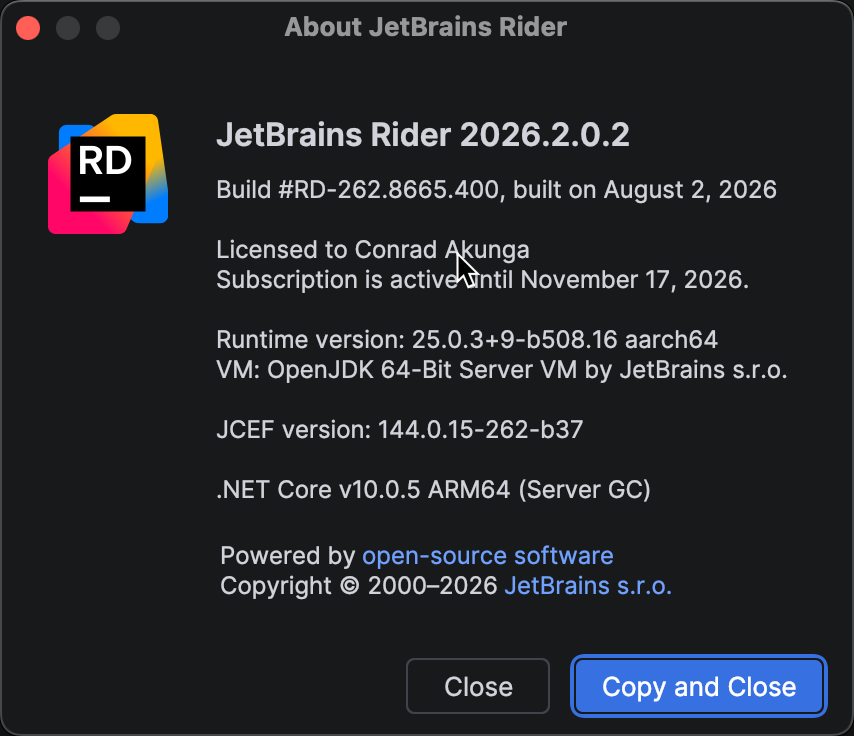
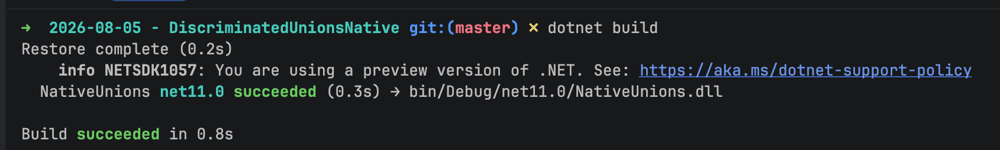
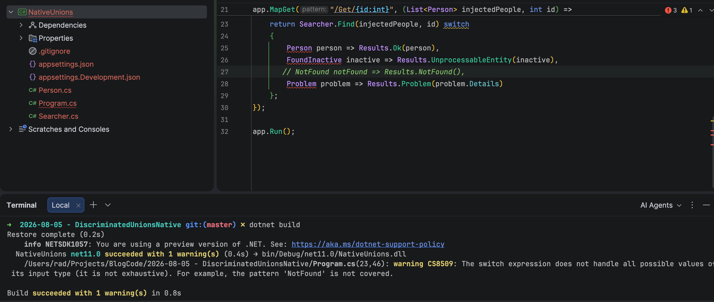
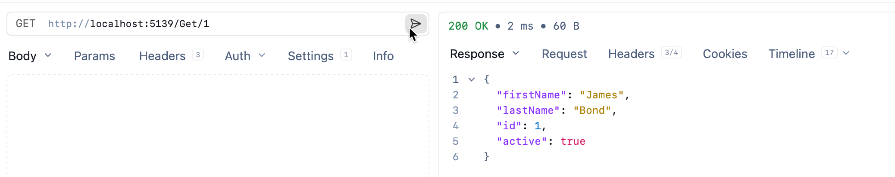
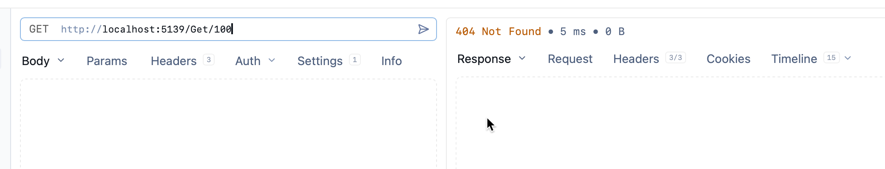
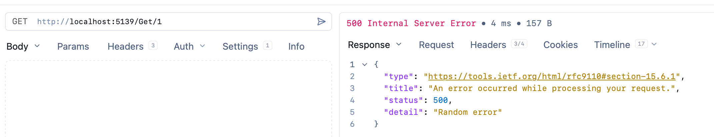
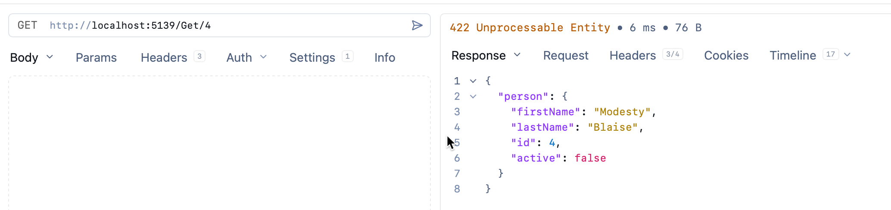

This is **Part 4** of a series on **Discriminated Unions**.

- [Part 1 - Introduction]()
- [Part 2 - Implementation]()
- [Part 3 - Practical Uses]()
- **Part 4 - .NET 11 Preview - Discriminated Unions Support (this post)**

In our **previous posts**, we looked at how to use the [OneOf](https://github.com/mcintyre321/OneOf) library to solve two different problems with a `type` system based on [discriminated unions](https://en.wikipedia.org/wiki/Tagged_union).

In this post, we will look at one of the more exciting features in .NET 11 - **native support for discriminated unions**.

For this, we will rewrite our previous `type` system to use the **native union** support rather than `OneOf`.

The first step is to change your project to use the preview features of C# 15.

Insert the following line into your `.csproj`

```xml
<LangVersion>preview</LangVersion>
```

It should now look like this:



The first step is to create a type using the [union](https://devblogs.microsoft.com/dotnet/csharp-15-union-types/) keyword.

```c#
public union FindResult(Person, FoundInactive, NotFound, Problem);
```

Here, we specify **all the possible return types**.

Next, we rewrite our `Searcher` to use this `type`, like this:

```c#
public sealed class Searcher
{
    public static FindResult Find(List<Person> people, int id)
    {
        try
        {
            // Randomly throw an exception
            if (Random.Shared.Next(0, 2) < 1)
                return new Problem("Random error");
            // Try and find the person
            var person = people.SingleOrDefault(x => x.ID == id);
            // Not found
            if (person is null)
                return new NotFound();
            // Found, but with caveats
            return person.Active switch
            {
                // Active, normal result
                true => person,
                // Inactive, edge case result
                false => new FoundInactive(person)
            };
        }
        catch (Exception e)
        {
            // Some other exception. Return this too
            return new Problem(e.Message);
        }
    }
}
```

**All we have changed is the return type**.

Next, we change our AP to process this:

```c#
// Setup endpoint
app.MapGet("/Get/{id:int}", (List<Person> injectedPeople, int id) =>
{
    return Searcher.Find(injectedPeople, id) switch
    {
        Person person => Results.Ok(person),
        FoundInactive inactive => Results.UnprocessableEntity(inactive),
        NotFound notFound => Results.NotFound(),
        Problem problem => Results.Problem(problem.Details)
    };
});
```

**Your IDE might not support this**, at least as of the time of writing.

Mine, for example, **doesn't**.



I am using the **latest** (at this time) version of JetBrains [Rider](https://www.jetbrains.com/rider/).



Don't mind the warnings - **the code will compile**.



A couple of things to **note** (despite the warnings)

1. **All the cases** have to be handled
2. You do not need to provide a **default** branch

For example, if I **comment out one branch**, I get this:



It should work as it did before:









## Thoughts

It is very welcome to have support in the **language and runtime**, but I feel there is **room for improvemen**t

1. Having to create a **completely new `type`**, the `FindResult`,  is very **cumbersome**. It should be possible to declare the discriminated union **inline**. Perhaps something like this:

    ```c#
    public static union(Person, FoundInactive, NotFound, Problem) Find(List<Person> people, int id)
    ```

    or

    ```c#
    public static (Person | FoundInactive | NotFound | Problem) Find(List<Person> people, int id)
    ```

2. **Failure to handle a branch** should give a **compiler error,** not a **warning**.
3. I actually **prefer** the `OneOf` implementation, as opposed to this.

It is, however, still a **preview** feature, so the work to refine it is **probably** continuing.

### TLDR

**Native support for discriminated unions is being previewed in the language and runtime.**

The code is in my [GitHub](https://github.com/conradakunga/BlogCode/tree/master/2026-08-05%20-%20DiscriminatedUnionsNative).

Happy hacking!
