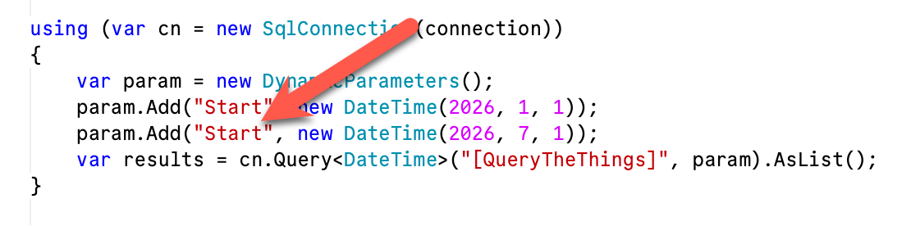
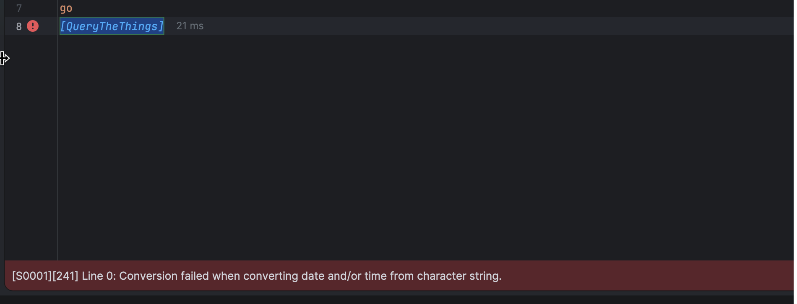
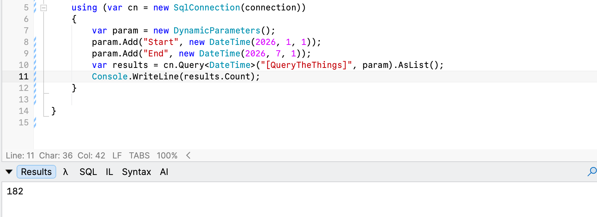

In a **previous** post, "[Beware - The Folly of Default Parameters in SQL Server Stored Procedures]()", we looked at a very common **gotcha** that can trip up developers when using [stored procedures](https://en.wikipedia.org/wiki/Stored_procedure).

This **tripped** me up **again** today.

The QA team reported that a report, populated by a **stored procedure**, was always returning the **same data regardless of the end date passed**.

The procedure, obfuscated to protect the **guilty**, was as follows:

```sql
create or alter proc [QueryTheThings] @Start date='1 jan 2026',
                                      @End date ='30 jun 2026'
as
begin
    select * from SystemDates where transactiondate between @Start and @End
end
```

This was called as follows:



The culprit was as indicated.

Given we are not passing an `@End`, the procedure **happily used the default it had - 30 June 2026**.

The code **should** read as follows:

```c#
using (var cn = new SqlConnection(connection))
{
  var param = new DynamicParameters();
  param.Add("Start", new DateTime(2026, 1, 1));
  param.Add("End", new DateTime(2026, 7, 1));
  var results = cn.Query<DateTime>("[QueryTheThings]", param).AsList();
}
```

The `End` parameter is now being passed.

A good solution to this problem is to take advantage of the fact that [SQL Server](https://www.microsoft.com/en-us/sql-server) **does not validate parameters at compile time**, but at runtime.

In other words, this is a valid procedure definition:

```sql
create or alter proc [QueryTheThings] @Start date='50 jan 2026',
                                      @End date ='50 jun 2026'
as
begin
    select TransactionDate from SystemDates where transactiondate between @Start and @End
end
```

Here we have passed an **invalid date.**

It is only **when you run it** that things go south.



If we **forget** to pass one parameter, we also get an error:


However, if we provide both, it runs perfectly.



### TLDR

**Provide an invalid default parameter value at compile time, such that if you forget to provide a valid one, an error is thrown.**

Happy hacking!
