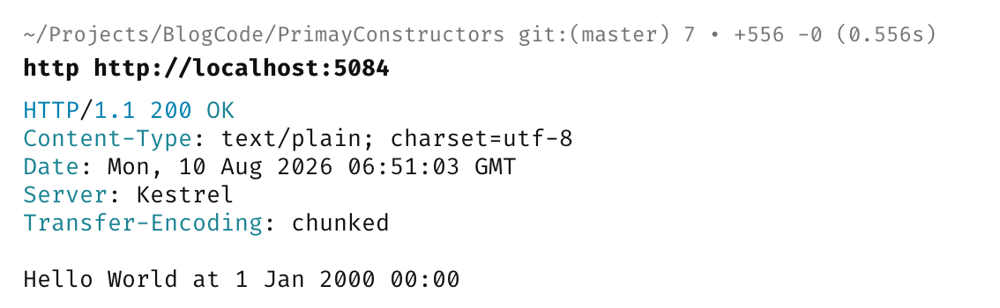

In a previous post, "[Primary Constructors - And Their Pitfalls,]()" we looked at [primary constructors](https://learn.microsoft.com/en-us/dotnet/csharp/whats-new/tutorials/primary-constructors).

Here we define our `types` like this:

```c#
public sealed class Spy(string Name, string Agency)
{
    public string PrintIdentification()
    {
        return $"Name: {Name}; Agency: {Agency}";
    }
}
```

Instead of like this:

```c#
public sealed class Spy
{
    public string Name { get; }
    public string Agency { get; }

    public Spy(string name, string agency)
    {
        Name = name;
        Agency = agency;
    }

    public string PrintIdentification()
    {
        return $"Name: {Name}; Agency: {Agency}";
    }
}
```

My problem with primary constructors was that the fields were **mutable**, and that seemed to be a huge **deal breaker** for me.

Since I wrote the post, I have had the opportunity to work with a number of projects and have had cause to **revise my opinion**.

**I still think the fact that the fields are mutable is a bad thing.**

However, there is a use case where I think primary constructors are usable - **dependency injection scenarios**. Why?

1. In dependency injection, the whole point is to pass `types` around
2. You fully own and control the classes wiring up and carrying out the dependency injection

Let us do a practical demonstration.

We need a **custom service** that sends a greeting along with the current time.

Since we want to test this, we'll use the [TimeProvider](https://learn.microsoft.com/en-us/dotnet/api/system.timeprovider?view=net-10.0) [abstraction](https://learn.microsoft.com/en-us/dotnet/standard/datetime/timeprovider-overview).

To support this, we need the `FakeTimeProvider` package.

```bash
dotnet add package Microsoft.Extensions.TimeProvider.Testing
```

Our `CustomService` will look like this:

```c#
public class CustomService(TimeProvider provider)
{
    public DateTime GetTime => provider.GetUtcNow().DateTime;
}
```

Here, you can see that we are using the **primary constructor** for the `provider` field.

Finally, we set up our DI.

```c#
using Microsoft.Extensions.Time.Testing;

var builder = WebApplication.CreateBuilder(args);
builder.Services.AddSingleton<TimeProvider>(new FakeTimeProvider(new DateTime(2000, 1, 1)));
builder.Services.AddSingleton<CustomService>();
var app = builder.Build();

app.MapGet("/", (CustomService service) => $"Hello World at {service.GetTime:d MMM yyyy HH:mm}");

app.Run();
```

Here you can see the **current time is set as midnight, 1 Jan 2000**.

We can then run our API and invoke the endpoint:



Everything works as expected.

### TLDR

**For internal use, such as wiring up DI, primary constructors are perfectly acceptable.**

The code is in my GitHub.

Happy hacking!
