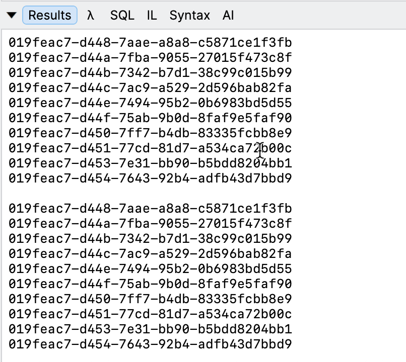
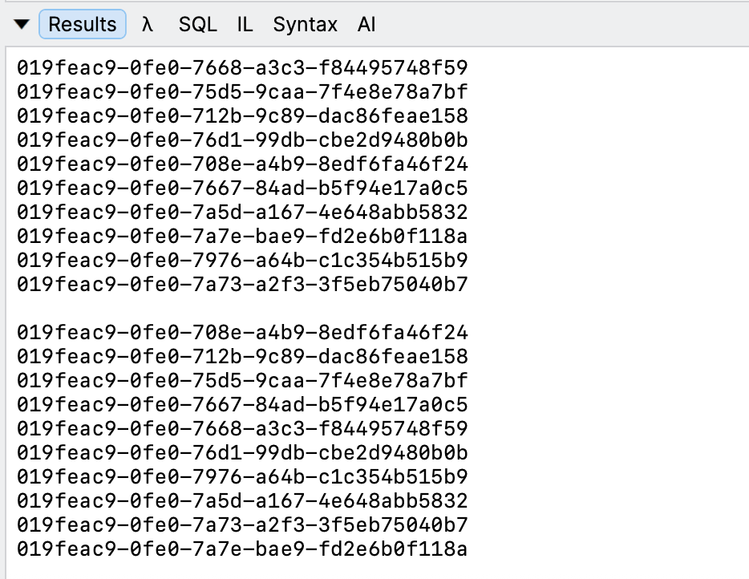
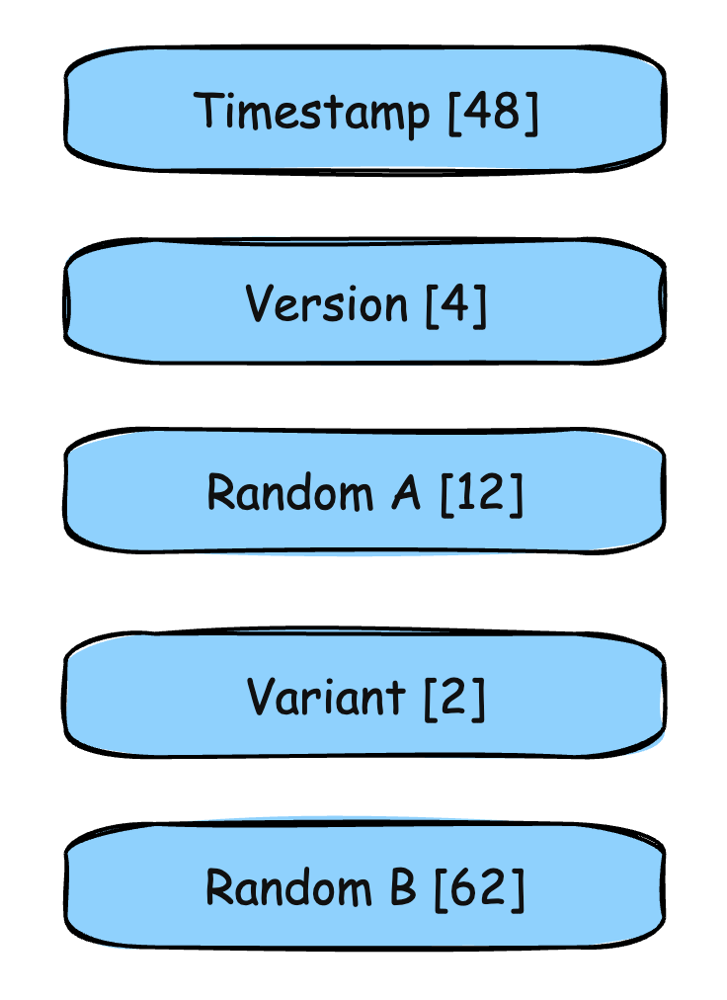

One of the features introduced in .NET 9 was ab ability to generate [RFC 9562](https://datatracker.ietf.org/doc/html/rfc9562) complaint [Guid](https://learn.microsoft.com/en-us/dotnet/api/system.guid?view=net-10.0) values, in the **version 7 format**.

These were meant to be **sortable** based on the **timestamp**.

They are generated like this:

```c#
Guid.CreateVersion7();
```

Let us generate a number of these, with a brief **pause** to simulate work:

```c#
var list = new List<Guid>();
	for (var i = 0; i < 10; i++)
	{
		var temp = Guid.CreateVersion7();
		Console.WriteLine(temp);
		list.Add(temp);
		Thread.Sleep(1);
	}

	Console.WriteLine();
```

As we generate each `s`, we add them to a `List` of `Guid`.

Once we are done, we **sort** this list and **print** the contents to the console.

```c#
list.Sort();

list.ForEach(x => Console.WriteLine(x));
```



Now let us **remove the pause**, so that our code looks like this:

```c#
var list = new List<Guid>();
for (var i = 0; i < 10; i++)
{
  var temp = Guid.CreateVersion7();
  Console.WriteLine(temp);
  list.Add(temp);
}

Console.WriteLine();

list.Sort();

list.ForEach(x => Console.WriteLine(x));
```

The results now are different!



We can see here that they sort **differently**.

To understand why we need to understand the structure of a V7 `Guid`.



Here I have illustrated the structure from **left to right**, with each section size in **bits**.

If the `Guid` generation happens to be at the same **millisecond**, sorting will switch to the **random blocks**, hence the difference in sorted output.

This means the sorted order will be different from the generated order.

### TLDR

**V7 `Guids` generated by `Guid.CreateVersion7()` sort differently if multiple happen to be generated in the same *millisecond*.**

The code is in my GitHub.

Happy hacking!
