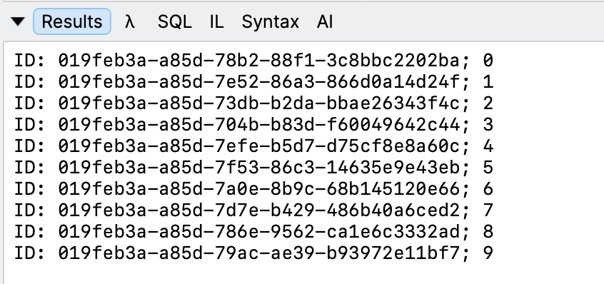
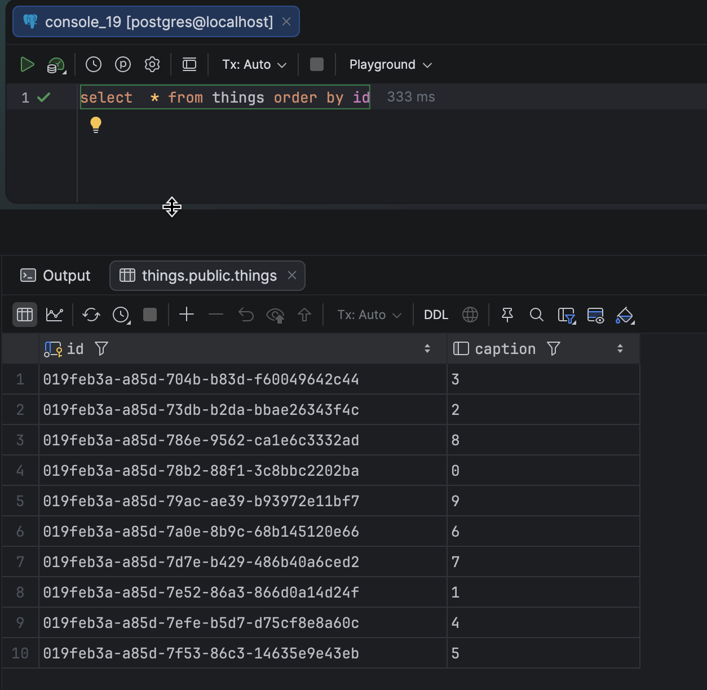

In our previous post, "[Beware - GuidV7 Generation In High Throughput Environments Sorting Gotcha]()", we looked at a common problem you will get when generating V7 `Guid` values in **volumes**, specifically if they happen to be over the same **timestamp** (in milliseconds).

This, naturally, is an issue should you be **generating keys** in your application for storage in the database.

Take this simple type:

```c#
public sealed record Thing(Guid ID, string Caption);
```

We will store that in this [PostgreSQL](https://www.postgresql.org/) database

```sql
create table public.things
(
    id      uuid not null
        constraint things_pk
            primary key,
    caption varchar(100)
);
```

Let us write some code to generate `10` of these:

```c#
const string connectionString = "host=localhost;username=myuser;password=mypassword;database=things";
var things = new List<Thing>();
for (var i = 0; i < 10; i++)
{
	things.Add(new Thing(Guid.CreateVersion7(), $"{i}"));
}

foreach (var thing in things)
{
  Console.WriteLine($"ID: {thing.ID}; {thing.Caption}");

  using (var cn = new NpgsqlConnection(connectionString))
  {
  	cn.Execute("insert into things(id,caption) values (@ID,@Caption)", thing);
  }
}
```

Here I am using the following libraries:

1. [Dapper](https://github.com/DapperLib/Dapper), for database access and manipulation
2. [Npgsql](https://www.npgsql.org/) [ADO.NET](https://learn.microsoft.com/en-us/dotnet/framework/data/adonet/ado-net-overview) provider

This will print the following:



If we query the **database** and sort by `ID`, we get the following:



Note that t**he order is not what we are expecting**, due to the issue pointed out earlier about `Guid` generation when the **millisecond timestamps** are the same.

This essentially means that the database has to **re-order the data on disk**, given that the records are inserted ordered by `Caption`, but have to be stored ordered by `ID`.

### TLDR

**Depending on the granularity of the generated IDs, V7 `Guid` will not sort in the order they were *created* when inserted into a database, which affects how the data is stored on disk.**

The code is in my [GitHub](https://github.com/conradakunga/BlogCode/tree/master/2026-08-09%20-%20GuidGeneration%20Database).

Happy hacking!
