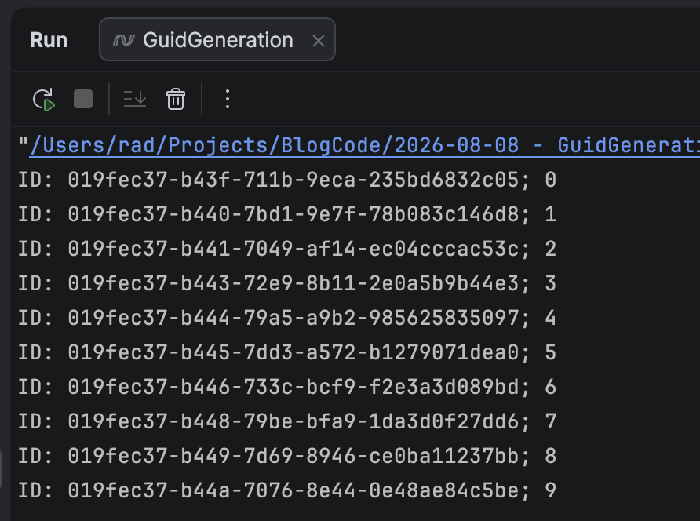
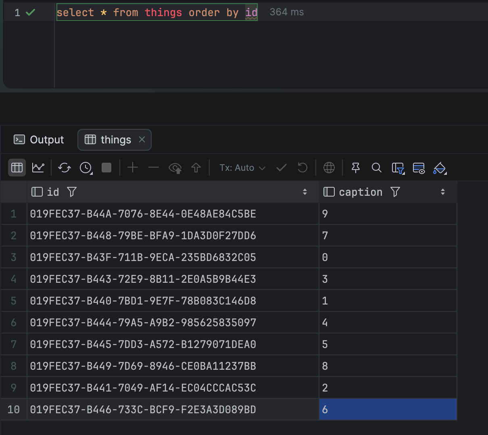
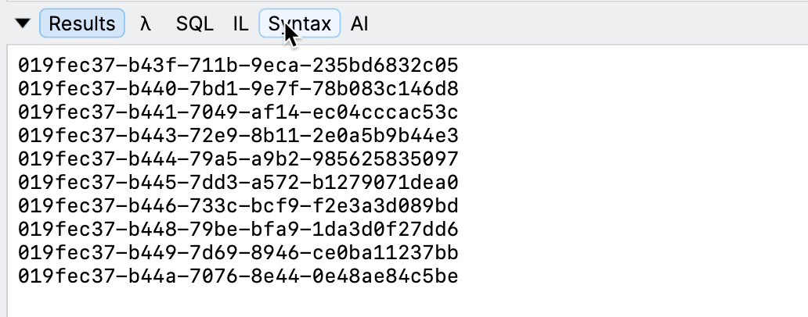

In our previous post, "[GuidV7 Considerations for Database Keys]()," we looked at how `GuidV7` generation for multiple values with the same timestamp presents a challenge: the generated values **sort differently**, affecting the **ordering of clustered indexes**.

In this post, we look at a different challenge revolving around how [SQL Server](https://www.microsoft.com/en-us/sql-server) sorts `Guid` values.

We will use the same `type` as before:

```c#
public sealed record Thing(Guid ID, string Caption);
```

We then have the following **SQL Server** table schema:

```sql
create table things
(
    id      uniqueidentifier not null
        constraint things_pk
            primary key,
    caption nvarchar(100)
);
```

We then generate some `Guid` values in **v7** format, ensuring a unique **timestamp**.

```c#
using Dapper;
using Microsoft.Data.SqlClient;

const string connectionString =
    "data source=localhost;uid=sa;password=YourStrongPassword123;database=things;trustservercertificate=true";
var things = new List<Thing>();
for (var i = 0; i < 10; i++)
{
    things.Add(new Thing(Guid.CreateVersion7(), $"{i}"));
    Thread.Sleep(TimeSpan.FromMilliseconds(1));
}

foreach (var thing in things)
{
    Console.WriteLine($"ID: {thing.ID}; {thing.Caption}");

    using (var cn = new SqlConnection(connectionString))
    {
        cn.Execute("insert into things(id,caption) values (@ID,@Caption)", thing);
    }
}
```

This will print something like this:



If we go to the database and order by `ID` ...



We can see here that they **are not ordered as we would expec**t.

We can verify that the `Guid` values should **sort by creation order**.

```c#
var list = new List<Guid>();
list.Add(Guid.Parse("019fec37-b43f-711b-9eca-235bd6832c05"));
list.Add(Guid.Parse("019fec37-b440-7bd1-9e7f-78b083c146d8"));
list.Add(Guid.Parse("019fec37-b441-7049-af14-ec04cccac53c"));
list.Add(Guid.Parse("019fec37-b443-72e9-8b11-2e0a5b9b44e3"));
list.Add(Guid.Parse("019fec37-b444-79a5-a9b2-985625835097"));
list.Add(Guid.Parse("019fec37-b445-7dd3-a572-b1279071dea0"));
list.Add(Guid.Parse("019fec37-b446-733c-bcf9-f2e3a3d089bd"));
list.Add(Guid.Parse("019fec37-b448-79be-bfa9-1da3d0f27dd6"));
list.Add(Guid.Parse("019fec37-b449-7d69-8946-ce0ba11237bb"));
list.Add(Guid.Parse("019fec37-b44a-7076-8e44-0e48ae84c5be"));
list.Sort();

list.ForEach(x => Console.WriteLine(x));
```

This should print the **same sequence as creation**:



The issue is around how `Guid` values are [sorted by SQL Server](https://blog.stackademic.com/uuid-v7-in-sql-server-can-you-really-use-it-the-limitation-nobody-tells-you-about-deep-dive-428b3877ebff) - it does not use the algorithm for `Guid` **v7**.

This essentially means `Guid.CreateVersion7()` **does not create values that SQL Server will correctly order for a clustered index**.

### TLDR

**SQL Server does not sort `Guid` values using an algorithm congruent with v7.**

The code is in my [GitHub](https://github.com/conradakunga/BlogCode/tree/master/2026-08-10%20-%20GuidGeneration%20SQL%20Server).

Happy hacking!
