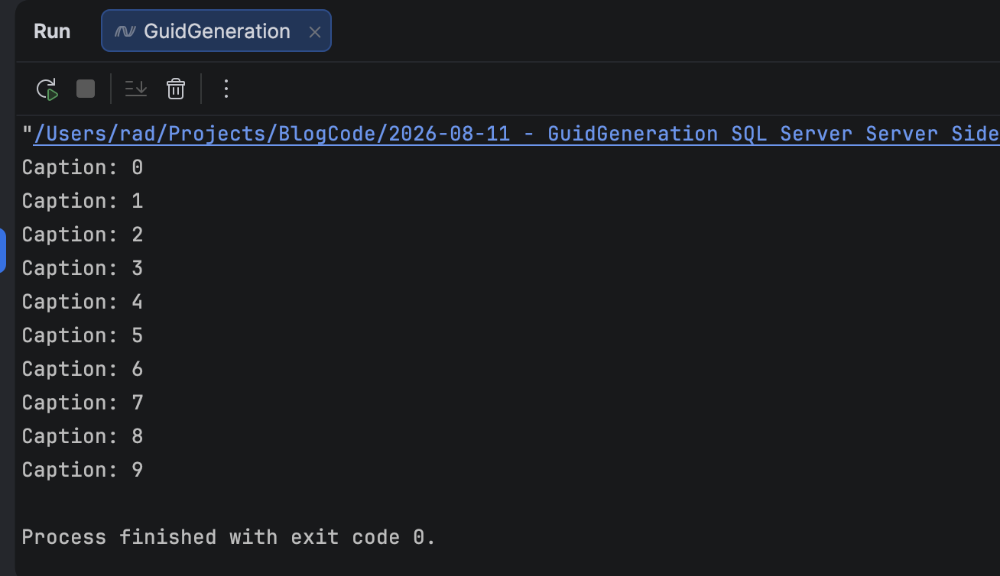
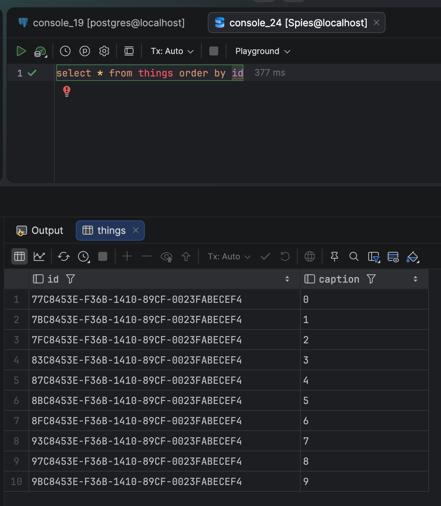

In [some]() [previous]() posts, we have seen the sort of challenges that may arise when generating `Guid` values for database keys, and in particular, an issue specific to [SQL Server](https://www.microsoft.com/en-us/sql-server) [Guid sorting]().

In a nutshell, client-generated `GUIDs` **do not sort correctly**, even when using `Guid.CreateVersion7()`, due to a complication when multiple `Guid` values are generated in the same **millisecond**.

Additionally, **SQL Server** sorts `Guids` using a [different algorithm]().

In this post, we will look at how to resolve this problem on the **server side**.

The solution here is to use the [NEWSEQUENTIALID()](https://learn.microsoft.com/en-us/sql/t-sql/functions/newsequentialid-transact-sql?view=sql-server-ver17) function.

We have looked at this previously in the post [Tip - Generating GUIDs for Use in Primary Keys in SQL Server]().

We will use our sample `type`, the `Thing`:

```c#
public sealed record Thing(Guid ID, string Caption);
```

Our table will look like this:

```sql
create table things
(
    id      uniqueidentifier primary key default (newsequentialid()),
    caption nvarchar(100) not null
)
```

Here we are using `NEWSEQUENTIALID()` to supply the **default** value. The function is **not usable as a normal function**.

Our code to **insert** will look like this:

```c#
using Dapper;
using Microsoft.Data.SqlClient;

const string connectionString =
    "data source=localhost;uid=sa;password=YourStrongPassword123;database=things;trustservercertificate=true";
var thingCaptions = new List<string>();
for (var i = 0; i < 10; i++)
{
    thingCaptions.Add($"{i}");
}

foreach (var thing in thingCaptions)
{
    Console.WriteLine($"Caption: {thing}");

    using (var cn = new SqlConnection(connectionString))
    {
        cn.Execute("insert into things(caption) values (@Caption)", new { Caption = thing });
    }
}
```

Upon **successful** execution, it will output this:



We can now go and inspect the **database**, by queriying all our `Thing` objects and sorting by `ID`.

```sql
select * from things order by id
```

We should see the following:



Here we can see they are **correctly ordered as they were inserted**.

### TLDR

**You can get correctly ordered `Guids` on the server side using the `NEWSEQUENTIALID()` function**

The code is in my [GitHub](https://github.com/conradakunga/BlogCode/tree/master/2026-08-11%20-%20GuidGeneration%20SQL%20Server%20Server%20Side).

Happy hacking!
