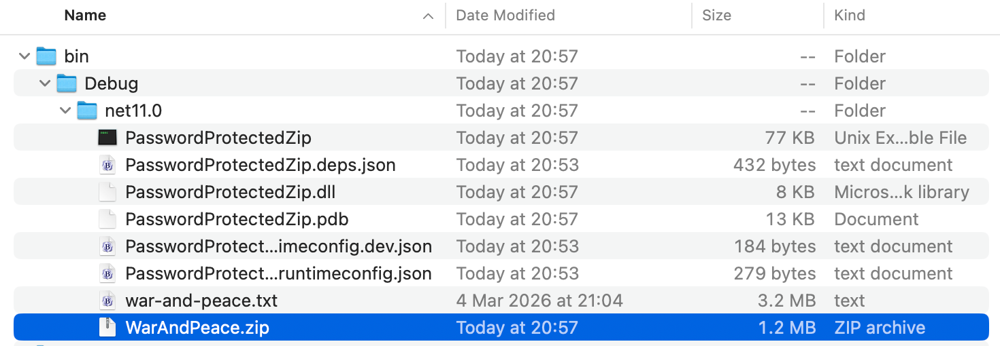
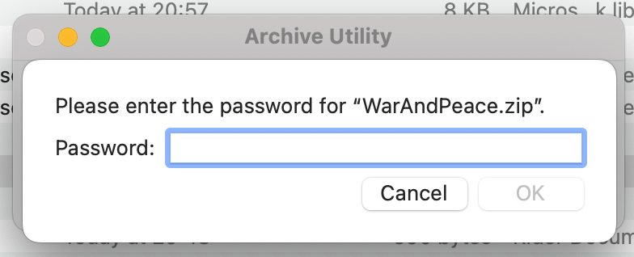

In some previous posts, "[How To Zip A Single File In C# & .NET]()" and "[How To Zip Multiple Files In C# & .NET]()", we have looked at how to create [zip](https://en.wikipedia.org/wiki/ZIP_(file_format)) files, either from a **single** file, a collection of files, or a directory.

However, it has not been possible to create password-protected zip files without resorting to **external tools** and **libraries**.

This has been addressed in .NET 11, using the `CreateEntryFromFileAsync` method.

Suppose we wanted to zip the contents of the great novel [War and Peace](https://en.wikipedia.org/wiki/War_and_Peace) by [Leo Tolstoy](https://en.wikipedia.org/wiki/Leo_Tolstoy) into a **password-protected archive**.

The code would look like this:

```c#
using System.IO.Compression;
using System.Reflection;
using Serilog;

// Setup logging
Log.Logger = new LoggerConfiguration()
    .WriteTo.Console()
    .CreateLogger();

// Set up the location of the target zip file
string targetZipFile =
    Path.Combine(Path.GetDirectoryName(Assembly.GetExecutingAssembly().Location)!, "WarAndPeace.zip");
// Set up the zip file password
const string ZipFilePassword = "LeoTolstoy123%#";

// Create the archive
await using (var archive = ZipFile.Open(targetZipFile, ZipArchiveMode.Create))
{
    // Add the file to the zip archive
    await archive.CreateEntryFromFileAsync("war-and-peace.txt", "War And Peace",
        CompressionLevel.SmallestSize,
        ZipFilePassword.AsMemory(), ZipEncryptionMethod.Aes256, CancellationToken.None);

    Log.Information("Compressed file to {ZipFile}", new FileInfo(targetZipFile).Name);
}
```

The magic is taking place in the `CreateEntryFromFileAsync` method, where:

1. We provide the **path to the file we want to compress**
2. We provide the **name** we want the **entry** to have, in this case, `War And Peace`
3. We provide the **password** as `ReadOnlyMemory<char>`
4. We provide the **compression level**
5. We provide the **encryption method**

If we run this code, we should see the following:


And in the file system:



If we try to open the file:



We get a prompt asking for the password.

### TLDR

**.NET 11 can now create password-protected zip files via the `CreateEntryFromFileAsync` method.**

The code is in my [GitHub](https://github.com/conradakunga/BlogCode/tree/master/2026-08-12%20-%20PasswordProtectedZip).

Happy hacking!
