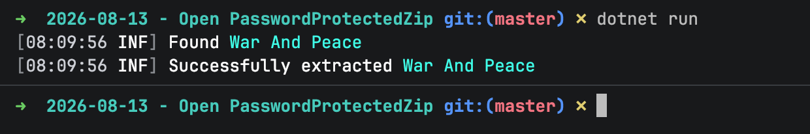
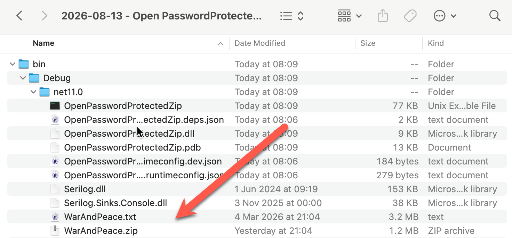

In our previous post, "[.NET 11 Preview - Generating Password-Protected Zip Archives]()", we looked at how to create **password protected** [zip](https://en.wikipedia.org/wiki/ZIP_(file_format)) archives in .NET 11, something that for a long time was **not possible without external tools and libraries**.

In this post, we will look at how to achieve the **reverse** - **opening** password protected zip archives.

This is possible using the `ZipExtractionOptions` in conjunction with the `ExtractToFileAsync` method.

**Note: as of writing this, the documentation is yet to be updated.**

The code is as follows:

```c#
using System.IO.Compression;
using System.Reflection;
using Serilog;

// Setup logging
Log.Logger = new LoggerConfiguration()
    .WriteTo.Console()
    .CreateLogger();

// Get the source zip
const string SourceZipFile = "WarAndPeace.zip";

// Set up the location of the target zip file
string targetFile =
    Path.Combine(Path.GetDirectoryName(Assembly.GetExecutingAssembly().Location)!, "WarAndPeace.txt");

// Set up the zip file password
const string ZipFilePassword = "LeoTolstoy123%#";

// Open the archive
await using (var archive = await ZipFile.OpenReadAsync(SourceZipFile))
{
    // Loop through the entries
    foreach (var entry in archive.Entries)
    {
        Log.Information("Found {Entry}", entry.FullName);

        // Configure extraction options
        var options = new ZipExtractionOptions
        {
            Password = ZipFilePassword.AsMemory(),
        };

        // Extract file
        await entry.ExtractToFileAsync(targetFile, options, CancellationToken.None);

        Log.Information("Successfully extracted {Entry}", entry.FullName);
    }
}
```

The magic is taking place here:

```c#
var options = new ZipExtractionOptions
{
	Password = ZipFilePassword.AsMemory(),
}
```

It is at this point that we are providing the **password** to the archive extraction code:

```c#
// Extract file
await entry.ExtractToFileAsync(targetFile, options, CancellationToken.None);
```

If we run this code, we should see the following:



And in our file system, we should see the following:



### TLDR

**.NET 11 can now natively extract files from password protected zip archives.**

The code is in my GitHub.

Happy hacking!
