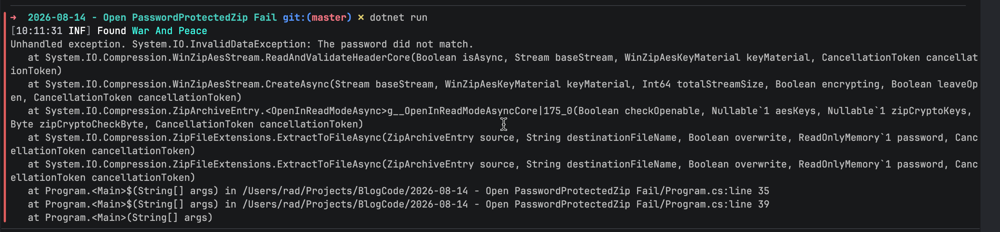
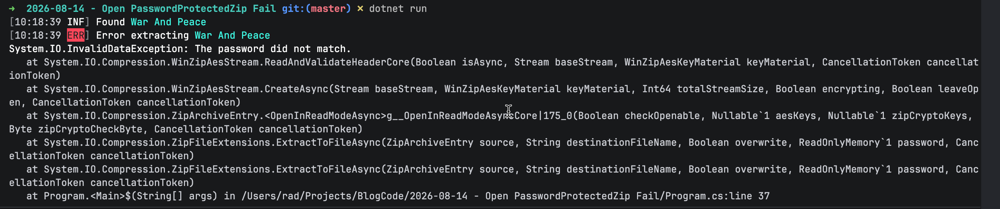

In our previous post, "[.NET 11 Preview - Opening Password Protected Zip Archives]()", we looked at how to **open password-protected zip archive**s, which is now **natively** possible on .NET 11.

However, we did not look at what happens if you provide an **invalid password**.

We shall do so in this post.

Let us adapt the code from the previous post to provide an **invalid password** and see what happens when we run the code:

```c#
using System.IO.Compression;
using System.Reflection;
using Serilog;

// Setup logging
Log.Logger = new LoggerConfiguration()
    .WriteTo.Console()
    .CreateLogger();

// Get the source zip
const string SourceZipFile = "WarAndPeace.zip";

// Set up the location of the target zip file
string targetFile =
    Path.Combine(Path.GetDirectoryName(Assembly.GetExecutingAssembly().Location)!, "WarAndPeace.txt");

// Set up the zip file password. This password is wrong
const string ZipFilePassword = "A_WRONG_PASSWORD";

// Open the archive
await using (var archive = await ZipFile.OpenReadAsync(SourceZipFile))
{
    // Loop through the entries
    foreach (var entry in archive.Entries)
    {
        Log.Information("Found {Entry}", entry.FullName);

        // Configure extraction options
        var options = new ZipExtractionOptions
        {
            Password = ZipFilePassword.AsMemory(),
        };

        // Extract file
        await entry.ExtractToFileAsync(targetFile, options, CancellationToken.None);

        Log.Information("Successfully extracted {Entry}", entry.FullName);
    }
}
```

If we run this, we get the following:



Here, we have gotten an [InvalidDataException](https://learn.microsoft.com/en-us/dotnet/api/system.io.invaliddataexception?view=net-11.0) indicating that the **password did not match**.

We can catch this in our code:

```c#
using System.IO.Compression;
using System.Reflection;
using Serilog;

// Setup logging
Log.Logger = new LoggerConfiguration()
    .WriteTo.Console()
    .CreateLogger();

// Get the source zip
const string SourceZipFile = "WarAndPeace.zip";

// Set up the location of the target zip file
string targetFile =
    Path.Combine(Path.GetDirectoryName(Assembly.GetExecutingAssembly().Location)!, "WarAndPeace.txt");

// Set up the zip file password. This password is wrong
const string ZipFilePassword = "A_WRONG_PASSWORD";

// Open the archive
await using (var archive = await ZipFile.OpenReadAsync(SourceZipFile))
{
    // Loop through the entries
    foreach (var entry in archive.Entries)
    {
        Log.Information("Found {Entry}", entry.FullName);

        // Configure extraction options
        var options = new ZipExtractionOptions
        {
            Password = ZipFilePassword.AsMemory(),
        };

        // Extract file
        try
        {
            await entry.ExtractToFileAsync(targetFile, options, CancellationToken.None);
            Log.Information("Successfully extracted {Entry}", entry.FullName);
        }
        catch (InvalidDataException ide)
        {
            Log.Error(ide, "Error extracting {Entry}", entry.FullName);
        }
        catch (Exception ex)
        {
            Log.Error(ex, "General error extracting archive");
        }
    }
}
```

Here we are doing the following:

- First, we check whether the `exception` is related to the file **extraction**, checking if it is an `InvalidDataException`
- We then trap **any other** `exception`, such as a full disk, or other such.

This will yield the following:



### TLDR

If, while opening a zip file, the password is incorrect, trap the `InvalidDataException`.

The code is in my GitHub.

Happy hacking!
