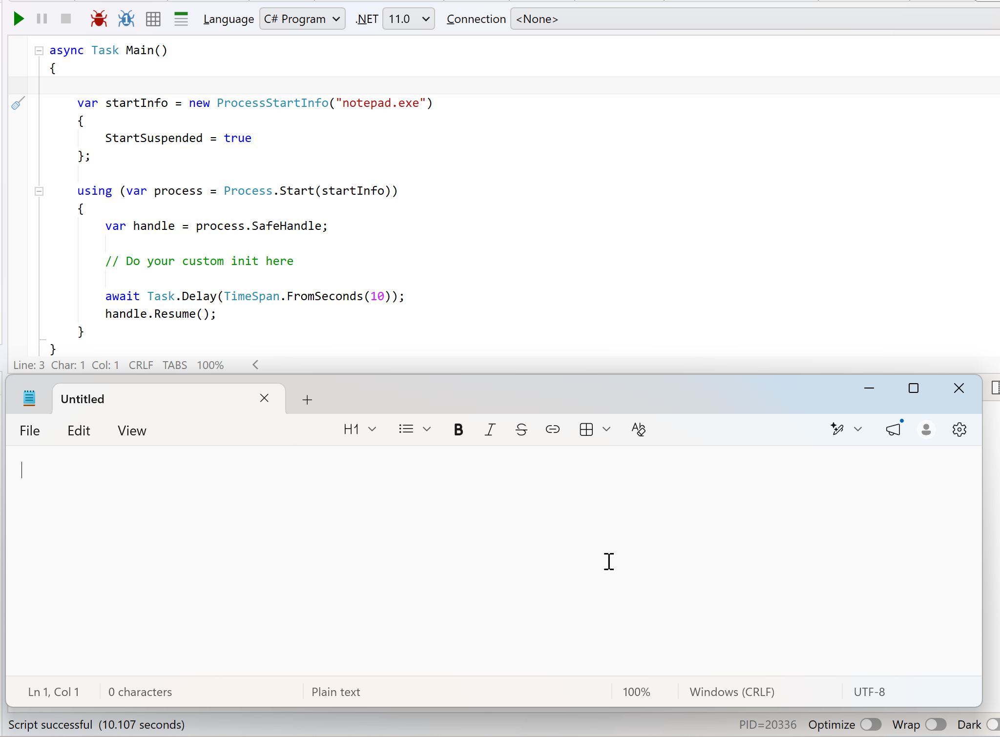

In a previous post, "[.NET 11 Preview - Starting A Detached Process]()", we looked at how to start a **detached** process.

A **detached** process is one that will **continue running even after the process that starts it exits**.

In this post we will look at something similar - how to start a **Suspended** process. A suspended process is one that is **started, but not executing**, hence the name. It is in a **suspended** state.

Take the following example:

```c#
var startInfo = new ProcessStartInfo("notepad.exe")
{
	StartSuspended = true
};

using (var process = Process.Start(startInfo))
{
  var handle = process.SafeHandle;

  // Do your custom init here

  await Task.Delay(TimeSpan.FromSeconds(10));
  handle.Resume();
}
```

Here, we are starting **notepad** in a **suspended** state.

We are then doing some custom **initialization** prior to resuming the process.

Custom initialization in this case is something like spinning up and attaching a **debugger**.

You will see after a 10 second pause, the **notepad** window appears.



**From preview 7, this also works in macOS.**

### TLDR

**You can now start processes in *suspended* state.**

Happy hacking!
