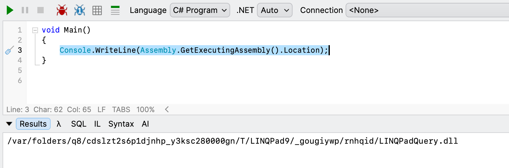
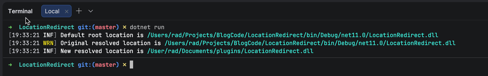
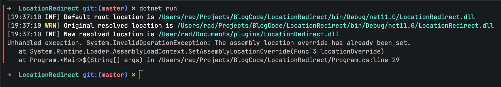

If you wanted to get the current **location** of the executing [Assembly](https://learn.microsoft.com/en-us/dotnet/standard/assembly/), you would do it like this:

```c#
Console.WriteLine(Assembly.GetExecutingAssembly().Location);
```

This would return something like this:



Generally, this is good enough.

However, suppose your application was **modular** and loaded plugins from a **particular location**, or, as is our case, is actually a **script** and not an actual **application**; and you wanted to get that location.

.NET 11 has an interesting solution to this problem - you can override the [Assembly.Location](https://learn.microsoft.com/en-us/dotnet/api/system.reflection.assembly.location?view=net-10.0).

You do it like this:

```c#
using System.Reflection;
using System.Runtime.Loader;
using Serilog;

Log.Logger = new LoggerConfiguration()
    .WriteTo.Console()
    .CreateLogger();

Log.Information("Default root location is {Original}", Assembly.GetExecutingAssembly().Location);

const string customDirectory = @"/User/rad/Documents/plugins/";

AssemblyLoadContext.SetAssemblyLocationOverride((assembly, defaultLocation) =>
{
    // View the default values
    Log.Warning("Original resolved location is {Original}", defaultLocation);

    // Get the assembly name
    var assemblyName = assembly.GetName().Name;

    if (assemblyName is not null)
        return Path.Combine(customDirectory, assemblyName + ".dll");
    return defaultLocation;
});

Log.Information("New resolved location is {Original}", Assembly.GetExecutingAssembly().Location);
```

This will print something like this:



Of interest here is:

1. The location **originally** resolved to `/Users/rad/Projects/BlogCode/LocationRedirect/bin/Debug/net11.0/LocationRedirect.dll`
2. It **now** resolves to `/User/rad/Documents/plugins/LocationRedirect.dll`

The method `AssemblyLoadContext.SetAssemblyLocationOverride` can only be ran **once** in your application's life cycle.

```c#
using System.Reflection;
using System.Runtime.Loader;
using Serilog;

Log.Logger = new LoggerConfiguration()
    .WriteTo.Console()
    .CreateLogger();

Log.Information("Default root location is {Original}", Assembly.GetExecutingAssembly().Location);

const string customDirectory = @"/User/rad/Documents/plugins/";

AssemblyLoadContext.SetAssemblyLocationOverride((assembly, defaultLocation) =>
{
    // View the default values
    Log.Warning("Original resolved location is {Original}", defaultLocation);

    // Get the assembly name
    var assemblyName = assembly.GetName().Name;

    if (assemblyName is not null)
        return Path.Combine(customDirectory, assemblyName + ".dll");
    return defaultLocation;
});

Log.Information("New resolved location is {Original}", Assembly.GetExecutingAssembly().Location);

// Change the location
AssemblyLoadContext.SetAssemblyLocationOverride((assembly, defaultLocation) =>
{
    // View the default values
    Log.Warning("Original resolved location is {Original}", defaultLocation);

    // Get the assembly name
    var assemblyName = assembly.GetName().Name;

    if (assemblyName is not null)
        return Path.Combine(customDirectory, assemblyName + "2.dll");
    return defaultLocation;
});
```

Here we are trying to set the location again.

If we run this code, we get the following result:



An [InvalidOperationException](https://learn.microsoft.com/en-us/dotnet/api/system.invalidoperationexception?view=net-10.0) is thrown, indicating the **override has already been se**t.

This is to prevent abuse by **silently redirecting** after initial configuration.

### TLDR

**In .NET 11 you can now set the reported location from a call to get an `Assembly` location.**

The code is in my GitHub.

Happy hacking!
