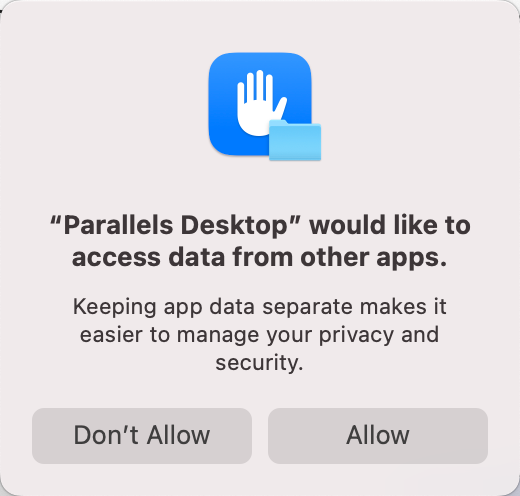
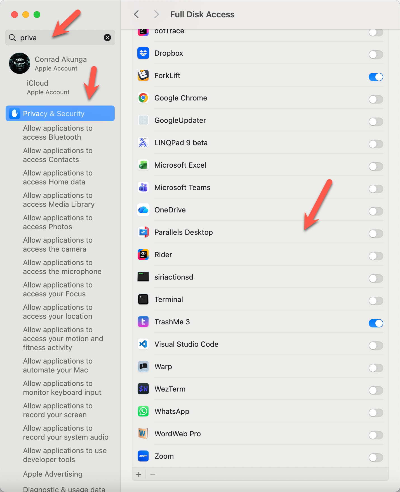

As I have mentioned a couple of times, my main development platform is an [Apple](https://www.apple.com/) [MacBook Pro](https://www.apple.com/ke/macbook-pro/) running [macOS](https://en.wikipedia.org/wiki/MacOS) [Sonoma](https://en.wikipedia.org/wiki/MacOS_Sonoma). Yes, I have yet to upgrade to [Golden Gate](https://en.wikipedia.org/wiki/MacOS_Golden_Gate).

I have a [Windows 11](https://en.wikipedia.org/wiki/Windows_11) Virtual machine, running under [Parallels](https://www.parallels.com/).

For some time I have been getting this prompt:

Naturally, I always click **Allow** and proceed.

But over time it got **irritating**, and I wondered if there was a way to **permanently** deal with it.

There is:

Go to the following **system setting**:

- Privacy & Security
- Full Disk Access
- Parallels Desktop

Click the button to turn it **ON**

No more prompt.

Happy hacking!
