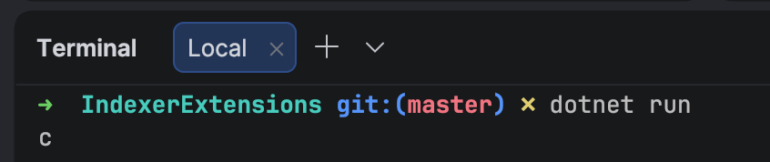

One of the more pivotal features of the .NET platform is the ability to access elements of a [collection](https://learn.microsoft.com/en-us/dotnet/csharp/language-reference/builtin-types/collections) as a [property](https://learn.microsoft.com/en-us/dotnet/csharp/programming-guide/classes-and-structs/properties), using an [indexer](https://learn.microsoft.com/en-us/dotnet/csharp/programming-guide/indexers/).

Take the following `collection`:

```c#
List<int> items = [0, 1, 2, 3, 4, 5, 6, 7];
```

To access the **third** element, one way to do it is as follows:

```c#
var element = items.ElementAt(2);
```

[ElementAt](https://learn.microsoft.com/en-us/dotnet/api/system.linq.enumerable.elementat?view=net-10.0) here is a function.

In languages like [Java](https://www.java.com/) that don't have properties, this is how you'd do it.

In .NET, there is another way to do it: using a `property`.

```c#
var element = items[2];
```

This works using a construct called an `indexer`.

For a long time, indexers have not been available to [extension methods](https://learn.microsoft.com/en-us/dotnet/csharp/programming-guide/classes-and-structs/how-to-implement-and-call-a-custom-extension-method).

Suppose we wanted to implement a extension method to `IEnumerable<char>`, `ItemAt`, that returns the [character](https://learn.microsoft.com/en-us/dotnet/api/system.char?view=net-10.0) at a particular element.

We'd do it like this:

```c#
public static class EnumerableExtensions
{
	public static char ItemAt(this IEnumerable<char> str, int index)
	{
		return str.ElementAt(index);
	}
}
```

This we use as follows:

```c#
str.ItemAt(0);
```

It has not been possible to impelment this as a property.

This is now available in .NET 11.

```c#
public static class EnumerableExtensions
{
    extension(IEnumerable<char> enumerable)
    {
        public int this[int index] => enumerable.ElementAt(index);
    }
}
```

The magic of the indexer is happening here:

```c#
public int this[int index] => enumerable.ElementAt(index);
```

We would use it like this:

```c#
Console.WriteLine((char)str[0]);
```

This should print the following:



### TLDR

**In .NET 11, you can now implement property indexers.**

The code is in my [GitHub](https://github.com/conradakunga/BlogCode/tree/master/2026-08-21%20-%20IndexerExtensions).

Happy hacking!
