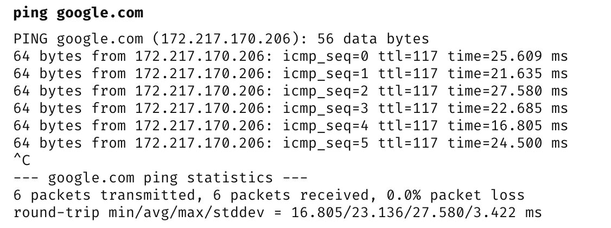
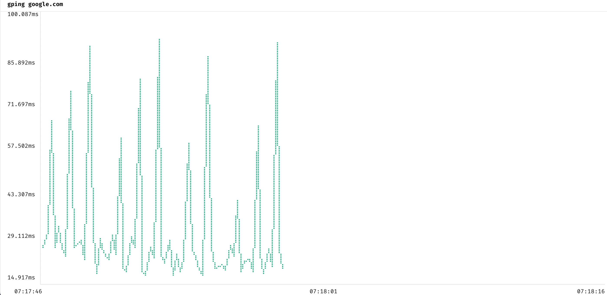
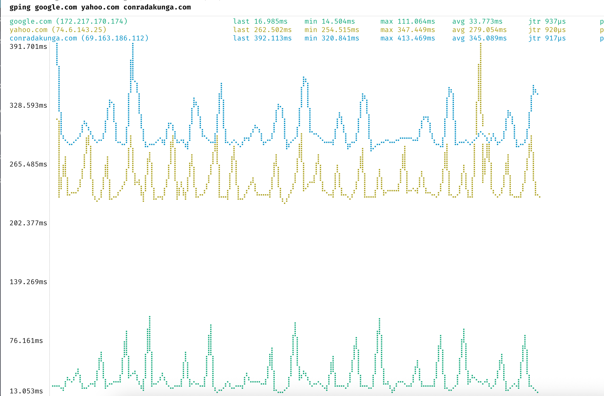

One of the **command-line tools** you will undoubtedly have in your toolbox is the veritable [ping](https://en.wikipedia.org/wiki/Ping_(networking_utility)) command.

This is what you would reach for if you wanted to check **one (or more)** of the following:

1. Whether you are **online**
2. Whether a **remote address** is **online**
3. The **latency** of the remote address

You would typically use it like this:

```bash
ping google.com
```

And you would get a result like this:



I recently discovered an even **better** implementation - [gping](https://github.com/orf/gping)  - ping, but with **graphs**.

It works the same way:

```bash
gping google.com
```

The results, however, are much easier to **visualize** and **interpret**.



Here we get back a **graph** that lets you **visualize latency over time**.

It is also useful when you want to compare **multiple addresses**.

Take this example, 

- [Google](google.com)
- [Yahoo](yahoo.com)
- [ConradAkunga](conradakunga.co)

We can ping them together as follows:

```bash
gping google.com yahoo.com conradakunga.com
```

The results would be as follows:



Here we can see all the `ping` results returned, rendered as **multiple**, **color-coded** graphs.

We can see here that [Google](https://google.com/) is **significantly faster** than the other two, but this is almost certainly because [Google](https://google.com/) has a [local edge presence and peers with my ISP](https://peering.google.com/).

### TLDR

**`Gping` is a better `ping`.**

Happy hacking!
