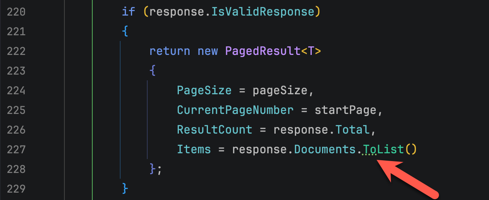
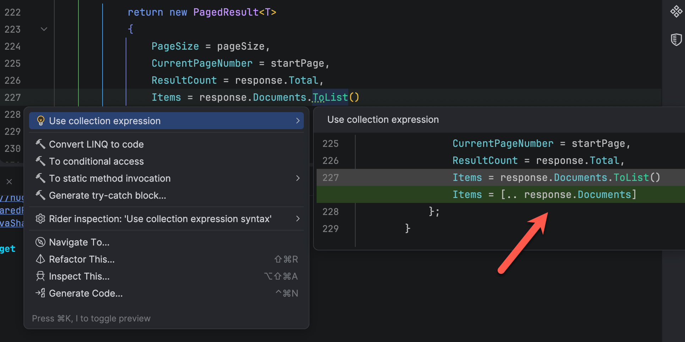

My daily driver IDE is [JetBrains](https://www.jetbrains.com/) [Rider](https://www.jetbrains.com/rider/), that I have been a **paying** customer for quite some years now.

It is an **excellent** IDE for **general purpose** and **specialized** C# & .NET Development.

Recently, I wrote some code like this:

```c#
if (response.IsValidResponse)
{
  return new PagedResult<T>
  {
    PageSize = pageSize,
    CurrentPageNumber = startPage,
    ResultCount = response.Total,
    Items = response.Documents.ToList()
  };
}
```

At which point my IDE changed like this, indicating that it has a **suggestion**.



The details were as follows:



Essentially, the suggestion was to **change** the code to this:

```c#
if (response.IsValidResponse)
{
  return new PagedResult<T>
  {
    PageSize = pageSize,
    CurrentPageNumber = startPage,
    ResultCount = response.Total,
    Items = [.. response.Documents]
  };
}
```

The magic is happening here:

```c#
Items = [.. response.Documents]
```

This is a feature called [collection expressions](https://learn.microsoft.com/en-us/dotnet/csharp/language-reference/operators/collection-expressions).

Locally the following are identical:

```c#
Items = [.. response.Documents]
  
Items = response.Documents.ToList()
```

In fact, the former is probably, at face value, a **slightly better** solution because if we were ever to change Items from a [List](https://learn.microsoft.com/en-us/dotnet/api/system.collections.generic.list-1?view=net-10.0) to an [Array](https://learn.microsoft.com/en-us/dotnet/csharp/language-reference/builtin-types/arrays), the code would not need to change.

However this code is **clever** rather than being **clear**.

What is the difference? Code should always be **written to be understood**, to be **clear** rather than to be **clever**.

This:

```c#
Items = response.Documents.ToList()
```

Tells you a bunch of things:

1. `response.Documents` is some sort of [collection](https://learn.microsoft.com/en-us/dotnet/csharp/language-reference/builtin-types/collections)
2. We explicitly want to turn it into a `List`

A quick **skim** of this code is generally easy to understand.

Where as this:

```c#
Items = [.. response.Documents]
```

Does not tell you too much at first glance.

Prefer the explicit, clearer code.

### TLDR

**Eschew cleverness over clarity.**

Happy hacking!
