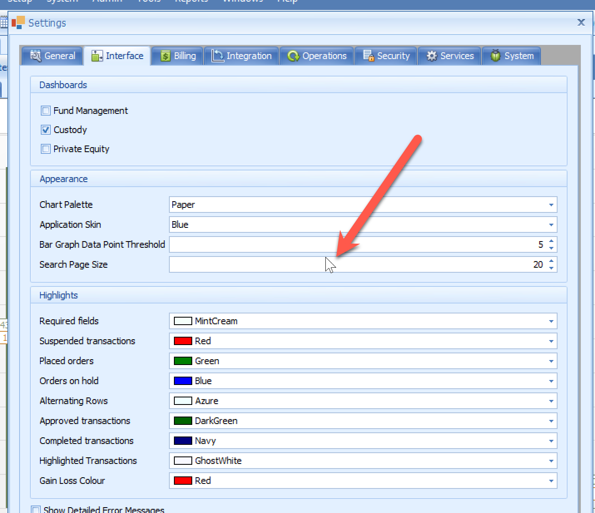
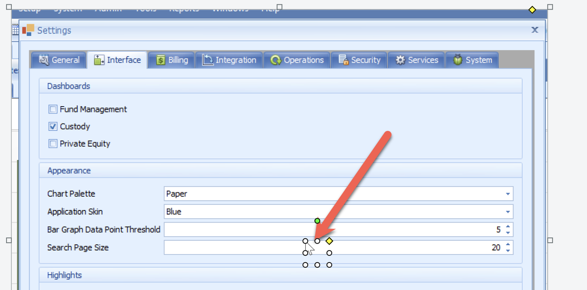
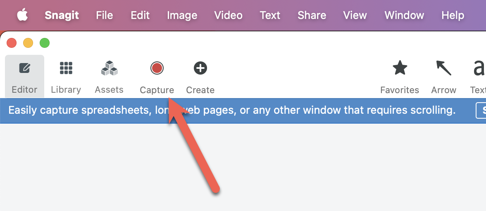
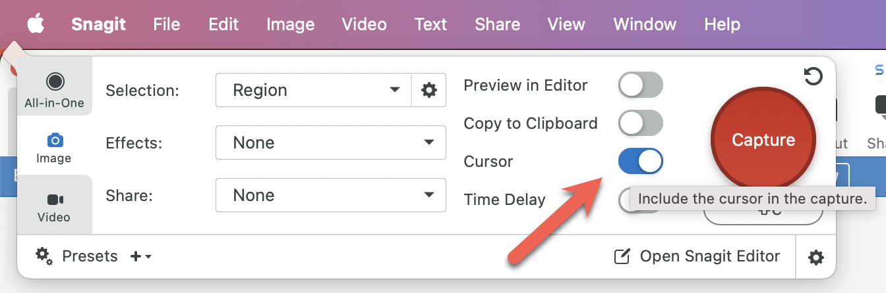
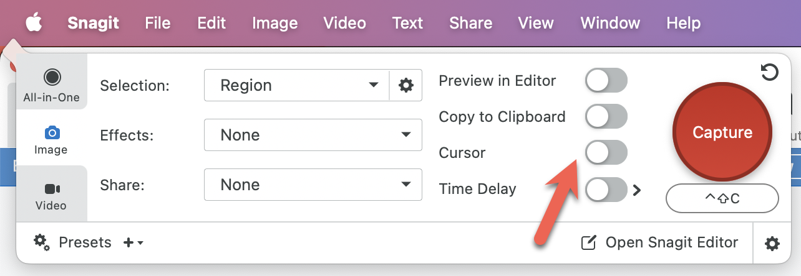

For over a decade now, my goto for screen capture has always been [TechSmith's](https://www.techsmith.com/) [SnagIt](https://www.techsmith.com/snagit/).

By default, when you take a screen capture using **SnagIt**, it will look like this:

Note that the location of the **cursor**.

This you can delete by **selecting it** and **deleting**.

However it can be **annoying** to have to keep doing it.

The solution is in the **capture settings**:

Turn **off** the following setting:

So that it looks like this:

And now new captures will no longer have the cursor.

Happy hacking!
