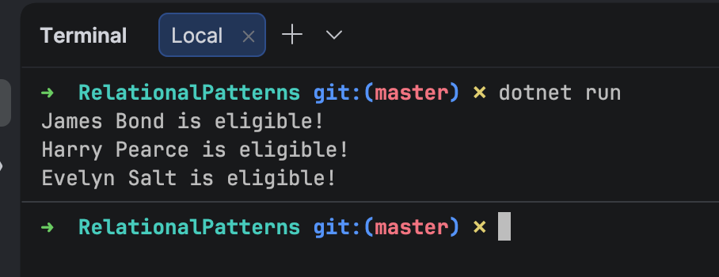

Boolean logic is at the heart of many algorithms that you implement or use in the course of writing software.

Take for example this type:

```c#
public record Person(string FullName, DateOnly DateOfBirth, string HomeTown, Gender Gender);
```

Gender is an enum that is defined thus:

```c#
public enum Gender
{
	Male,
	Famale
}
```

Suppose we wanted to process Person types, based on the following criteria:

> We want to recruit spies born between **1950** and **1965**.

The code would typically look like this:

```c#
void Process(Person person)
{
    if (person.DateOfBirth.Year >= 1950 && person.DateOfBirth.Year <= 1965)
        Console.WriteLine($"{person.FullName} is eligible!");
}
```

Next, we create a bunch of `Person` objects:

```c#
Person[] people =
[
    new Person("James Bond", new DateOnly(1960, 1, 1), "London", Gender.Male),
    new Person("Harry Pearce", new DateOnly(1955, 1, 1), "Cryodon", Gender.Male),
    new Person("Evelyn Salt", new DateOnly(1960, 1, 1), "Nairobi", Gender.Famale),
    new Person("Vesper Lynd", new DateOnly(1970, 1, 1), "Mombasa", Gender.Famale)
];
```

Finally we **process** them:

```c#
foreach (var person in people)
{
    Process(person);
}
```

This should print the following:



Now let us take a closer look at the logic:

```c#
if (person.DateOfBirth.Year >= 1950 && person.DateOfBirth.Year <= 1965)
	Console.WriteLine($"{person.FullName} is eligible!");
```

This can be simplified as follows:

```c#
if (person.DateOfBirth.Year is >= 1950 and <= 1965)
	Console.WriteLine($"{person.FullName} is eligible!");
```

Note the following improvements:

1. We no longer keep **repeating** `person.DateOfBirth.Year`
2. The logic is **easier to read** : `person.DateOfBirth.Year is >= 1950 and <= 1965` vs `person.DateOfBirth.Year >= 1950 && person.DateOfBirth.Year <= 1965`

This is called a [relational pattern](https://learn.microsoft.com/en-us/dotnet/csharp/fundamentals/functional/pattern-matching).

### TLDR

**Relational pattens can be used to simplify conditional logic.**

The code is in my GitHub.

Happy hacking!
