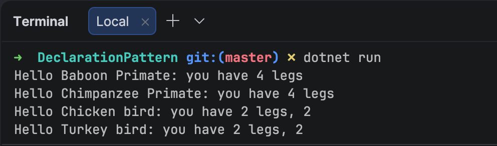

When working with [polymorphic](https://en.wikipedia.org/wiki/Polymorphism_(computer_science)) types, you often need to check an object's `type` before doing further processing.

Take this **base** `class`:

```c#
public abstract record Animal(string name, int legs);
```

This is **subclassed** into descendant types, starting with a `Primate`:

```c#
public record Primate(string Name, int Legs) : Animal(Name, Legs);
```

And a `Bird`:

```c#
public record Bird(string Name, int Legs, byte Wings) : Animal(Name, Legs);
```

You might then need to process an `Animal` with code like this:

```c#
void Process(Animal animal)
{
  if (animal is Bird)
  {
    var temp = (Bird)animal;
    Console.WriteLine($"Hello {temp.Name} bird: you have {temp.Legs} legs, {temp.Wings}");
  }
  else if (animal is Primate)
  {
    var temp = (Primate)animal;
    Console.WriteLine($"Hello {temp.Name} Primate: you have {temp.Legs} legs");
  }
}
```

We can see it in use as follows:

```c#
Animal[] animals =
[
    new Primate("Baboon", 4),
    new Primate("Chimpanzee", 4),
    new Bird("Chicken", 2, 2),
    new Bird("Turkey", 2, 2),
];

foreach (var animal in animals)
{
    Process(animal);
}
```

This will print the following:



Let us take a closer look at one of the logic checks:

```c#
if (animal is Bird)
{
  var temp = (Bird)animal;
  Console.WriteLine($"Hello {temp.Name} bird: you have {temp.Legs} legs, {temp.Wings}");
}
```

You can see here that we are doing two things:

1. We are **checking** the `type`
2. We then [cast](https://learn.microsoft.com/en-us/dotnet/csharp/programming-guide/types/casting-and-type-conversions) the `Animal` to the correct `Type`, now that we know it is **safe** to do so

This is repetitive.

The method can be simplified as follows:

```c#
void Process(Animal animal)
  {
  if (animal is Bird bird)
  {
    Console.WriteLine($"Hello {bird.Name} bird: you have {bird.Legs} legs, {bird.Wings}");
  }
  else if (animal is Primate primate)
  {
    Console.WriteLine($"Hello {primate.Name} Primate: you have {primate.Legs} legs");
  }
}
```

The magic is happening here:

```c#
if (animal is Bird bird)
```

The **check** and **cast** happen in one line.

This is easier to **read** and to **maintain**.

This is called the [declaration pattern](https://www.c-sharpcorner.com/blogs/understanding-the-declaration-pattern-in-c-sharp).

### TLDR

**The declaration pattern lets you write concise, clear polymorphic code.**

The code is in my Github.

Happy hacking!
