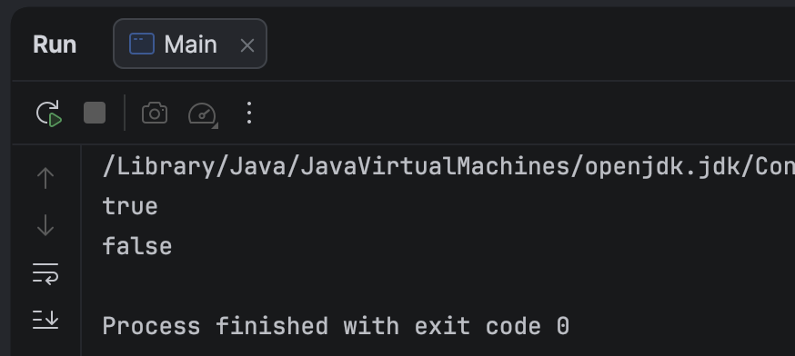
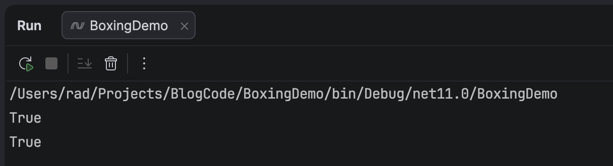

I ran into an interesting scenario the other day quite by chance when helping someone understand some code.

Take  the following [Java](https://www.java.com/) code:

```java
void main() {
    Integer first = 100;
    Integer second = 100;

    IO.println(first == second);

    first = 200;
    second = 200;

    IO.println(first == second);
}
```

This, of course, **isn't how you'd write this code in production**, but just to illustrate a point.

This code prints the following:



This was a surprise to me.

**Why would two different values return different results for the same logic?**

Java, if you are not familiar has two kinds of types:

- [Primitives](https://docs.oracle.com/javase/tutorial/java/nutsandbolts/datatypes.html)
- [Reference](https://medium.com/@rt040371/understanding-reference-types-in-java-a-guide-to-classes-interfaces-arrays-and-more-137b3200248b)

**Primitives** consist of `byte`, `short`, `int`, `long`, `float`, `double`, `boolean`, `char`.

However, by design, Java converts **primitives** into **equivalent** reference types. This is called [boxing](https://en.wikipedia.org/wiki/Boxing_(computer_programming)).

The equivalent **reference** types for the **primitives** are `Byte`, `Short`, `Long`, `Float`, `Double`, `Boolean` and `Char`.

When we write code like this:

```java
 Integer first = 100;
```

We are using the **boxed** type directly.

Here, `first` is now an instance of a class, and the logic `==`, as you know, compares **references**, not **values**.

Which is different from this:

```java
int first = 100;
```

So technically,

```java
IO.println(first == second);
```

Should always return `false`.

But why does it return `true` with a value of `100` but not `200`?

Turns out that such comparisons were such a common scenario, that the Java runtime at startup [transparently creates and caches](https://nataliiadziubenko.com/2024/10/13/Java-integer-caching-how-and-why.html) a bunch of `integers`, ranging from `-128` to `127`.

So when we use `100`, the runtime uses these cached values for comparison.

However, `200` is past the `128` threshold, and so new instances are actually created.

This is why the check returns `false` for `200`.

This code should be written like this:

```c#
int first = 100;
int second = 100;

IO.println(first == second);

first = 200;
second = 200;

IO.println(first == second);
```

Further, if you even find yourself using `==` for `classes`, **chances are you are doing the wrong thing**.

You should instead be using `.equals()`.

This is not the case with [C#](https://dotnet.microsoft.com/en-us/languages/csharp) that does not have this problem.

The equivalent code is as follows:

```c#
Int32 first = 100;
Int32 second = 100;

Console.WriteLine(first == second);

first = 200;
second = 200;

Console.WriteLine(first == second);
```

Again, you would typically not write it this way, as C# does not have boxing. `Int32` is an alias for `int`.

This prints what we expect:



### TLDR

**Java has some optimizations that change the behaviour of comparison of boxed primitive types.**

The code is in my GitHub.

Happy hacking!
