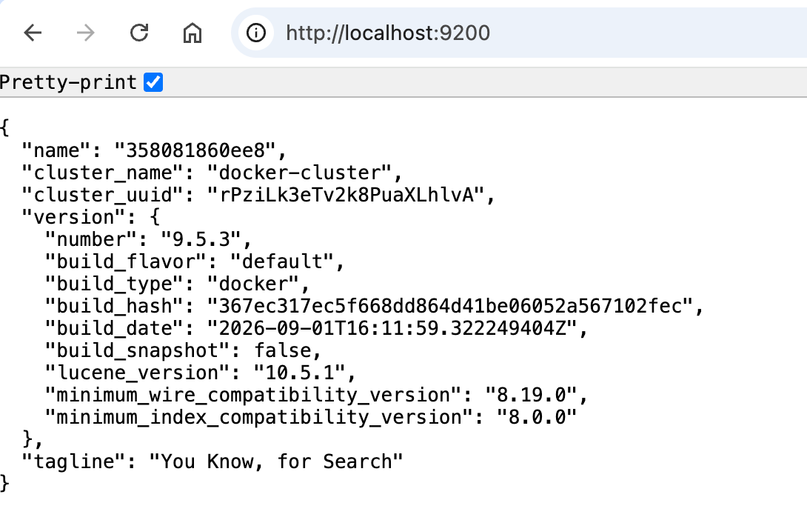
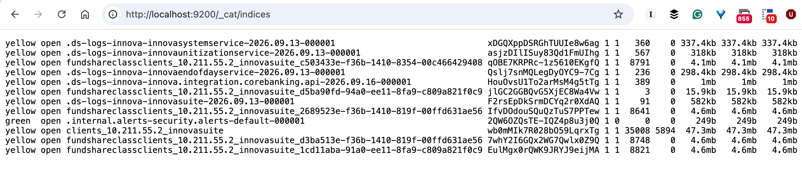
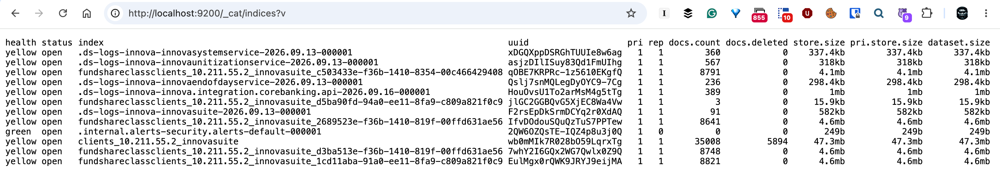
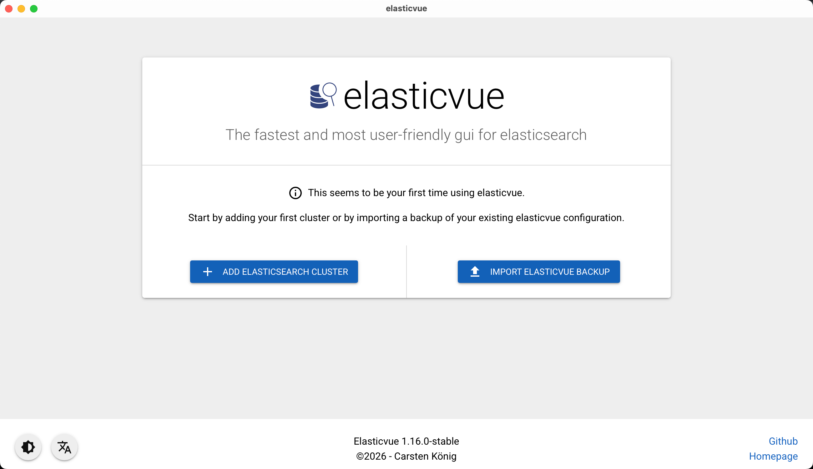
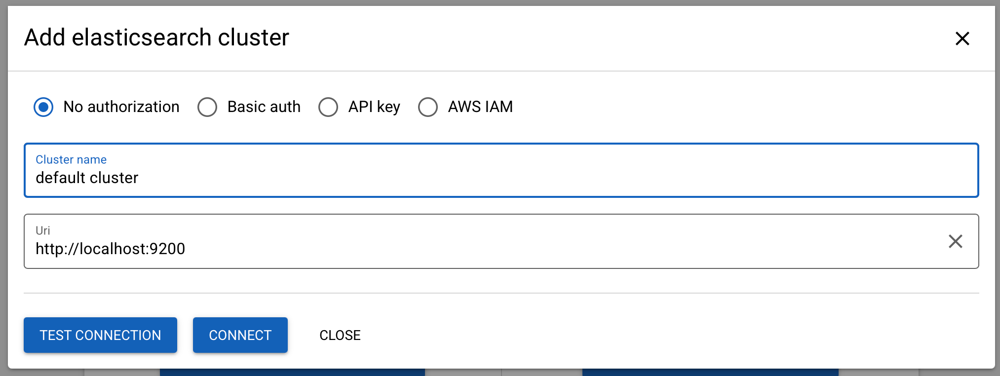
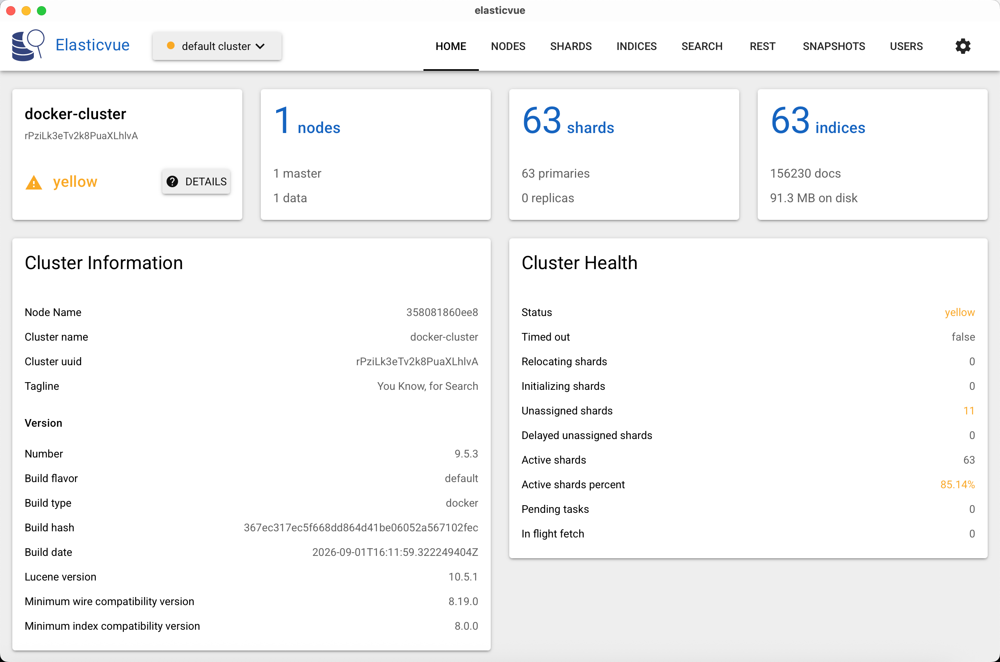
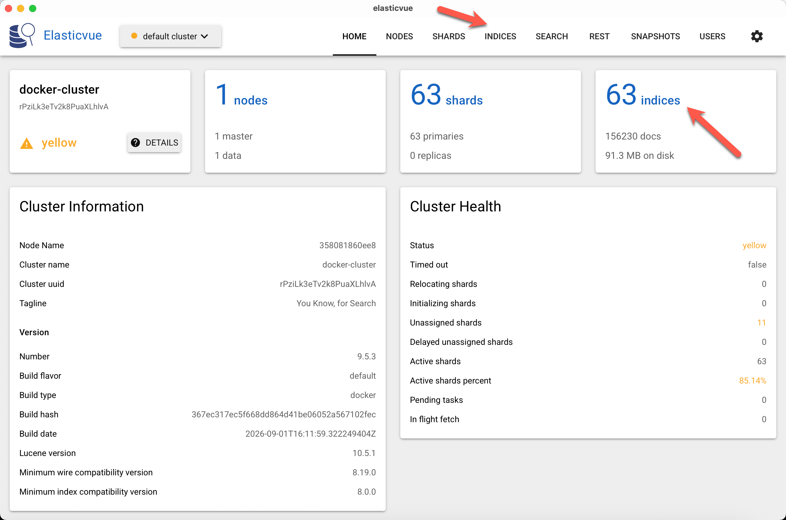
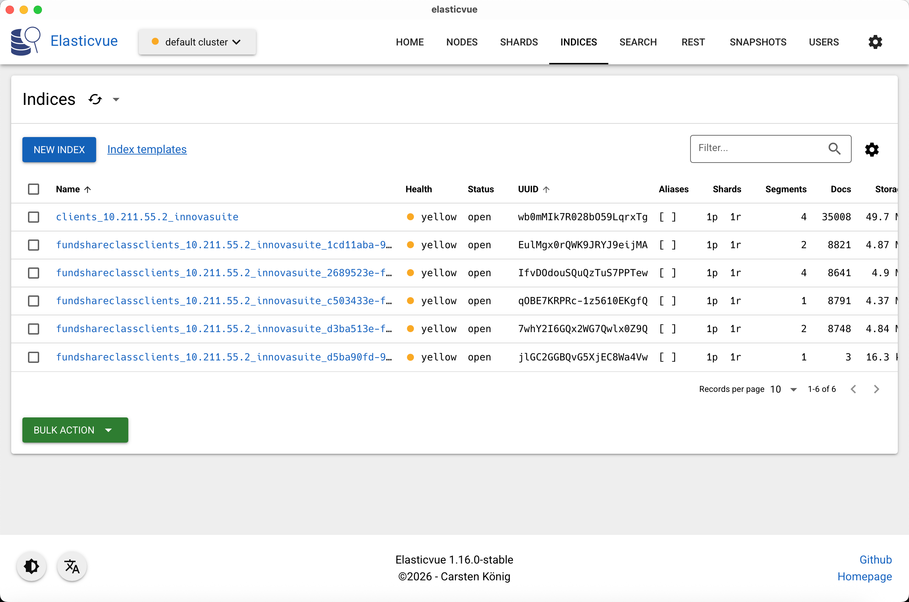
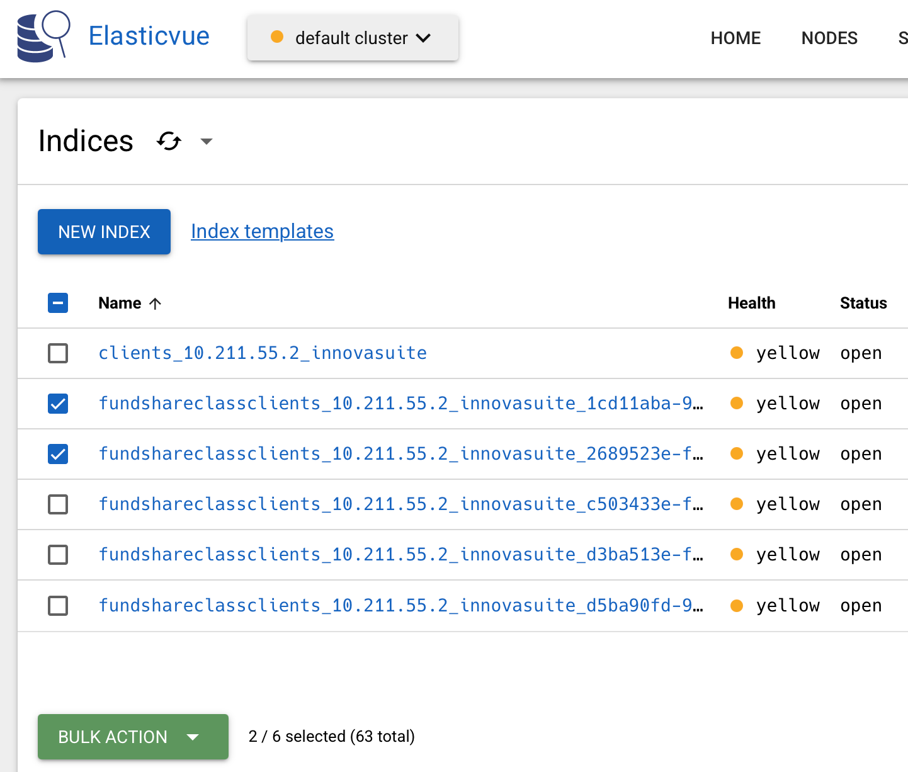
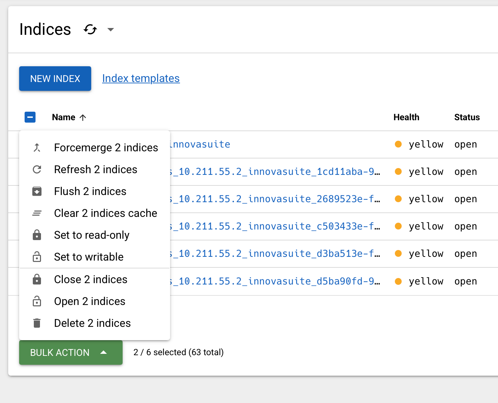

If you are integrating search into your applications, chances are you are using the excellent [ElasticSearch](https://www.elastic.co/elasticsearch).

It is pretty trivial to check whether the service is up: send a [GET](https://developer.mozilla.org/en-US/docs/Web/HTTP/Reference/Methods/GET) request to the root of the sever on port `9200`.

In my case this is `http://localhost/9200`

This should return something like this:



To view the **actual indexes** (assuming your code has indexed your data before) is a bit more work.

Send a `GET` request to the following address `http://localhost:9200/_cat/indices`.

This will return something like this:



Which is a bit **cryptic**.

You can view a bit more **detail** (and **column headers**) by using the following `GET` request `http://localhost:9200/_cat/indices?v`.



Better, but still **ungainly**.

A better solution to this is the tool [ElasticVue](https://elasticvue.com/), available as a [standalone desktop app](https://elasticvue.com/installation/) or as **browser plugin** for your favourite browser, currently [Chrome](https://chrome.google.com/webstore/detail/elasticvue/hkedbapjpblbodpgbajblpnlpenaebaa), [Edge](https://microsoftedge.microsoft.com/addons/detail/geifniocjfnfilcbeloeidajlfmhdlgo) and [Firefox](https://addons.mozilla.org/en-US/firefox/addon/elasticvue/).

It is also available as a [docker container](https://hub.docker.com/r/cars10/elasticvue) or a [web app](https://app.elasticvue.com/).

On **macOS**, you can install it using [homebrew](https://brew.sh/).

```bash
brew install --cask elasticvue
```

Upon launch, you will see the following config screen:



Click  '**Add Elastic Search Cluster**'.



This will take you to a screen that shows the status of your closet.



From here, click '**indices**' to view the current indexes in the cluster.



This will take you to a section where you can **view** the current indexes.



From here you can **view** the data, or select one or more indexes for **management**.



You can then click the ''**Bulk Action**'' button for actions you can carry out on the selected indexes.



### TLDR

***ElasticView* is a powerful utility you can use to view and manage Elastic Search Indexes.**
